# Schéma ContextCentralThread - Architecture Complète et Complexe

## 1. Vue d'ensemble de l'écosystème Release-Centric complet

```plantuml
@startuml ContextCentralThread_CompleteEcosystem
!theme spacelab
!define RECTANGLE class

package "External Interface Layer" <<Cloud>> {
  component [Web Central UI] as WebUI
  component [REST API Clients] as RestClients
  component [Cinema Management Systems] as CinemaSystems
  component [Content Providers] as ContentProviders
}

package "HTTP Communication Layer" <<Frame>> {
  component [HTTP Server :8500] as HTTPServer
  component [HttpCentralHandlerFactory] as HandlerFactory
  component [HttpCentralHandler] as HTTPHandler
  component [Session Manager] as SessionMgr
  
  HTTPServer --> HandlerFactory : creates handlers
  HandlerFactory --> HTTPHandler : instantiates
  HTTPHandler --> SessionMgr : manages sessions
}

package "Command & Response Management" <<Database>> {
  component [Command Queue\n(Thread-Safe)] as CmdQueue
  component [Response Queue\n(Thread-Safe)] as RespQueue
  component [CommandCentral Parser] as CmdParser
  component [XML Response Builder] as RespBuilder
  
  note right of CmdQueue
    Utilise Poco::Mutex pour thread safety
    Map<UUID, shared_ptr<CommandCentral>>
    Accès concurrent sécurisé
  end note
}

package "Core Processing Engine" <<Node>> {
  component [ContextCentralThread\n(Priority: PRIO_HIGH)] as MainThread
  component [CentralContext\n(Singleton)] as CentralCtx
  component [Timer & Watchdog\n(50ms cycle)] as Timer
  
  note top of MainThread
    Thread principal avec boucle 50ms
    Gestion prioritaire des commandes
    Surveillance performance
  end note
}

package "Release-Centric State Management" <<Component>> {
  component [BoundaryStateManager] as StateManager
  component [BPMN State Machines\nper Release] as BPMN
  component [State Transition Engine] as TransitionEngine
  component [Release Registry] as ReleaseRegistry
  component [COB_Configurator] as COBConfig
  
  StateManager --> BPMN : manages multiple instances
  BPMN --> TransitionEngine : executes transitions
  StateManager --> ReleaseRegistry : tracks all releases
  StateManager --> COBConfig : configures interactions
}

package "Content & Release Domain Model" <<Rectangle>> {
  entity "Content" as Content {
    + id : int
    + name : string
    + description : string
    + created_date : datetime
    + status : ContentStatus
    --
    + getTypes() : List<Type>
    + getLocalisations() : List<Localisation>
    + createRelease(type, localisation) : Release
  }
  
  entity "Type" as Type {
    + id : int
    + name : string (2D, 3D, IMAX, etc.)
    + technical_specs : string
    --
    + isCompatibleWith(cinema) : bool
  }
  
  entity "Localisation" as Localisation {
    + id : int
    + language : string
    + region : string
    + subtitle_format : string
    --
    + getCompatibleCinemas() : List<Cinema>
  }
  
  entity "Release" as Release {
    + contentId : int
    + typeId : int
    + localisationId : int
    + state : ReleaseState
    + created_date : datetime
    + last_updated : datetime
    + cis_file_path : string
    + sync_files : List<string>
    + cpl_list : List<CPL>
    --
    + getUniqueKey() : string
    + canProgress() : bool
    + getAvailableTransitions() : List<Transition>
  }
  
  Content ||--o{ Release : "has multiple"
  Type ||--o{ Release : "variant"
  Localisation ||--o{ Release : "localized"
}

package "Cinema Infrastructure" <<Rectangle>> {
  entity "Group" as Group {
    + id : int
    + name : string
    + region : string
    --
    + getCinemas() : List<Cinema>
    + getActiveReleases() : List<Release>
  }
  
  entity "Cinema" as Cinema {
    + id : int
    + name : string
    + location : string
    + group_id : int
    --
    + getAuditoriums() : List<Auditorium>
    + getCompatibleReleases() : List<Release>
    + deployRelease(release) : bool
  }
  
  entity "Auditorium" as Auditorium {
    + id : int
    + name : string
    + cinema_id : int
    + screen_type : ScreenType
    + audio_system : AudioSystem
    --
    + canPlayRelease(release) : bool
    + getScheduledShows() : List<Show>
  }
  
  Group ||--o{ Cinema : "contains"
  Cinema ||--o{ Auditorium : "has"
  Cinema }o--o{ Release : "can deploy"
}

package "Content Processing Components" <<Component>> {
  component [CIS Processor\n(Content Ingestion)] as CISProcessor
  component [Sync File Handler] as SyncHandler
  component [CPL Generator\n(Composition Playlist)] as CPLGenerator
  component [Content Validator] as ContentValidator
  component [Packaging Engine] as PackagingEngine
  
  note right of CISProcessor
    Traite un seul CIS par release
    Validation format et intégrité
    Stockage sécurisé
  end note
}

package "Database & Persistence Layer" <<Database>> {
  database "MySQL ICE Database" as ICEDB {
    table "contents" as ContentTable
    table "types" as TypeTable  
    table "localisations" as LocalTable
    table "releases" as ReleaseTable
    table "groups" as GroupTable
    table "cinemas" as CinemaTable
    table "auditoriums" as AudTable
    table "release_states" as StateTable
    table "content_files" as FilesTable
  }
  
  component [MySQLDBConnection\n(Connection Pool)] as DBConn
  component [Query Builder & ORM] as QueryBuilder
  component [Transaction Manager] as TxManager
  
  DBConn --> ICEDB : manages connections
  QueryBuilder --> DBConn : executes queries
  TxManager --> DBConn : handles transactions
}

' ================== CONNECTIONS ==================

' External to HTTP
WebUI --> HTTPServer : "HTTP Requests"
RestClients --> HTTPServer : "API Calls"
CinemaSystems --> HTTPServer : "Integration"
ContentProviders --> HTTPServer : "Content Upload"

' HTTP to Command Processing
HTTPHandler --> CmdParser : "parse XML commands"
CmdParser --> CmdQueue : "enqueue commands"
HTTPHandler --> RespQueue : "retrieve responses"
RespBuilder --> HTTPHandler : "build XML responses"

' Core Processing
MainThread --> CmdQueue : "getFirstCommand()\n(50ms cycle)"
MainThread --> CentralCtx : "getCurrentContext()"
MainThread --> StateManager : "release operations"
MainThread --> RespQueue : "addResponse()"
Timer --> MainThread : "controls timing"

' State Management to Domain
StateManager --> Release : "manages lifecycle"
BPMN --> Content : "processes content"
TransitionEngine --> Type : "validates compatibility"
ReleaseRegistry --> Localisation : "tracks localizations"

' Content Processing
StateManager --> CISProcessor : "ProcessUploadCIS()"
StateManager --> SyncHandler : "ProcessUploadSync()"
StateManager --> CPLGenerator : "CREATE_CPL"
CISProcessor --> ContentValidator : "validates files"
CPLGenerator --> PackagingEngine : "packages content"

' Infrastructure Relations
Group --> Release : "manages distribution"
Cinema --> Release : "deploys to screens"
Auditorium --> Release : "plays content"

' Database Connections
CentralCtx --> QueryBuilder : "executeQuery()"
StateManager --> DBConn : "state persistence"
Content --> ContentTable : "stored in"
Release --> ReleaseTable : "tracked in"
Group --> GroupTable : "managed in"
Cinema --> CinemaTable : "registered in"

' Processing to Database
CISProcessor --> FilesTable : "stores file refs"
SyncHandler --> FilesTable : "sync file tracking"
CPLGenerator --> FilesTable : "CPL references"

@enduml
```

## 2. Machine d'État BPMN Complète des Releases

```plantuml
@startuml Release_BPMN_StateMachine
!theme spacelab

title "Machine d'État BPMN des Releases - Cycle de Vie Complet"

state "Release Lifecycle Management" as RLM {
  
  [*] --> PENDING_CREATION : "Request CREATE_RELEASE"
  
  state PENDING_CREATION {
    PENDING_CREATION : Validation des paramètres
    PENDING_CREATION : contentId, typeId, localisationId
    PENDING_CREATION : Vérification unicité release
    PENDING_CREATION : Allocation ressources
  }
  
  PENDING_CREATION --> CREATED : "BoundaryStateManager::CreateRelease()\nSUCCESS"
  PENDING_CREATION --> CREATION_FAILED : "Validation échoue\nERROR"
  
  state CREATED {
    CREATED : Release initialisée
    CREATED : State machine démarrée
    CREATED : Clé unique: contentId_typeId_localisationId
    CREATED : Attente upload CIS
    CREATED : Status: WAITING_CIS
  }
  
  CREATED --> PENDING_CIS_UPLOAD : "UPDATE_CIS reçu"
  
  state PENDING_CIS_UPLOAD {
    PENDING_CIS_UPLOAD : Validation fichier CIS
    PENDING_CIS_UPLOAD : Un seul CIS par release autorisé
    PENDING_CIS_UPLOAD : Vérification format XML/JSON
    PENDING_CIS_UPLOAD : Stockage sécurisé
  }
  
  PENDING_CIS_UPLOAD --> CIS_UPLOADED : "ProcessUploadCIS()\nSUCCESS\nTransition: CIS_CREATED"
  PENDING_CIS_UPLOAD --> CIS_UPLOAD_FAILED : "Validation CIS échoue\nERROR"
  
  state CIS_UPLOADED {
    CIS_UPLOADED : CIS validé et stocké
    CIS_UPLOADED : Métadonnées extraites
    CIS_UPLOADED : Attente synchronisation
    CIS_UPLOADED : Status: WAITING_SYNC
  }
  
  CIS_UPLOADED --> PENDING_SYNC_UPLOAD : "CREATE_SYNCLOOP reçu"
  
  state PENDING_SYNC_UPLOAD {
    PENDING_SYNC_UPLOAD : Validation fichiers sync
    PENDING_SYNC_UPLOAD : Vérification compatibilité avec CIS
    PENDING_SYNC_UPLOAD : Traitement multi-fichiers possible
    PENDING_SYNC_UPLOAD : Validation timing et séquences
  }
  
  PENDING_SYNC_UPLOAD --> SYNC_UPLOADED : "ProcessUploadSync()\nSUCCESS\nTransition: SYNC_CREATED"
  PENDING_SYNC_UPLOAD --> SYNC_UPLOAD_FAILED : "Validation sync échoue\nERROR"
  
  state SYNC_UPLOADED {
    SYNC_UPLOADED : Fichiers sync validés
    SYNC_UPLOADED : Synchronisation configurée
    SYNC_UPLOADED : Prêt pour génération CPL
    SYNC_UPLOADED : Status: READY_FOR_CPL
  }
  
  SYNC_UPLOADED --> PENDING_CPL_GENERATION : "CREATE_CPL déclenché\nautomatiquement ou manuellement"
  
  state PENDING_CPL_GENERATION {
    PENDING_CPL_GENERATION : Analyse du contenu
    PENDING_CPL_GENERATION : Génération Composition Playlist
    PENDING_CPL_GENERATION : Validation conformité DCI
    PENDING_CPL_GENERATION : Création paquets de distribution
  }
  
  PENDING_CPL_GENERATION --> CPL_READY : "Génération CPL réussie\nTransition: CPL_CREATED"
  PENDING_CPL_GENERATION --> CPL_GENERATION_FAILED : "Erreur génération CPL\nERROR"
  
  state CPL_READY {
    CPL_READY : CPL(s) générée(s)
    CPL_READY : Contenu packagé
    CPL_READY : Prêt pour validation finale
    CPL_READY : Status: READY_FOR_VALIDATION
  }
  
  CPL_READY --> PENDING_VALIDATION : "Validation automatique\nou manuelle"
  
  state PENDING_VALIDATION {
    PENDING_VALIDATION : Tests d'intégrité
    PENDING_VALIDATION : Validation technique
    PENDING_VALIDATION : Vérification compatibilité cinémas
    PENDING_VALIDATION : Approbation workflow
  }
  
  PENDING_VALIDATION --> VALIDATED : "Validation réussie\nREADY_FOR_DISTRIBUTION"
  PENDING_VALIDATION --> VALIDATION_FAILED : "Validation échoue\nERROR"
  
  state VALIDATED {
    VALIDATED : Release validée
    VALIDATED : Prête pour distribution
    VALIDATED : Calcul compatibilité cinémas
    VALIDATED : Status: READY_FOR_PRODUCTION
  }
  
  VALIDATED --> PENDING_DEPLOYMENT : "IMPORT_TO_PROD reçu"
  
  state PENDING_DEPLOYMENT {
    PENDING_DEPLOYMENT : Sélection cinémas cibles
    PENDING_DEPLOYMENT : Vérification capacités auditoriums
    PENDING_DEPLOYMENT : Planification déploiement
    PENDING_DEPLOYMENT : Transfert vers serveurs cinéma
  }
  
  PENDING_DEPLOYMENT --> DEPLOYED : "Déploiement réussi\nTransition: IN_PRODUCTION"
  PENDING_DEPLOYMENT --> DEPLOYMENT_FAILED : "Échec déploiement\nERROR"
  
  state DEPLOYED {
    DEPLOYED : Release en production
    DEPLOYED : Active dans cinémas
    DEPLOYED : Monitoring actif
    DEPLOYED : Status: IN_PRODUCTION
  }
  
  DEPLOYED --> ARCHIVED : "Fin de vie\nretrait programmé"
  
  state ARCHIVED {
    ARCHIVED : Release archivée
    ARCHIVED : Plus en distribution
    ARCHIVED : Données conservées
    ARCHIVED : Status: ARCHIVED
  }
  
  ' États d'erreur
  state "Error States" as ErrorStates {
    state CREATION_FAILED {
      CREATION_FAILED : Paramètres invalides
      CREATION_FAILED : Release déjà existante
      CREATION_FAILED : Ressources insuffisantes
    }
    
    state CIS_UPLOAD_FAILED {
      CIS_UPLOAD_FAILED : Format CIS invalide
      CIS_UPLOAD_FAILED : Fichier corrompu
      CIS_UPLOAD_FAILED : Limite taille dépassée
    }
    
    state SYNC_UPLOAD_FAILED {
      SYNC_UPLOAD_FAILED : Incompatibilité avec CIS
      SYNC_UPLOAD_FAILED : Timing invalide
      SYNC_UPLOAD_FAILED : Fichiers manquants
    }
    
    state CPL_GENERATION_FAILED {
      CPL_GENERATION_FAILED : Contenu non conforme
      CPL_GENERATION_FAILED : Erreur technique
      CPL_GENERATION_FAILED : Ressources insuffisantes
    }
    
    state VALIDATION_FAILED {
      VALIDATION_FAILED : Tests d'intégrité échoués
      VALIDATION_FAILED : Non-conformité DCI
      VALIDATION_FAILED : Incompatibilité cinémas
    }
    
    state DEPLOYMENT_FAILED {
      DEPLOYMENT_FAILED : Échec transfert
      DEPLOYMENT_FAILED : Incompatibilité serveurs
      DEPLOYMENT_FAILED : Erreur réseau
    }
  }
  
  ' Transitions de récupération depuis les états d'erreur
  CREATION_FAILED --> PENDING_CREATION : "Retry après correction\nparamètres"
  CIS_UPLOAD_FAILED --> CREATED : "Retry avec nouveau CIS"
  SYNC_UPLOAD_FAILED --> CIS_UPLOADED : "Retry avec nouveaux\nfichiers sync"
  CPL_GENERATION_FAILED --> SYNC_UPLOADED : "Retry génération CPL"
  VALIDATION_FAILED --> CPL_READY : "Retry après corrections"
  DEPLOYMENT_FAILED --> VALIDATED : "Retry déploiement"
  
  ' Transition finale
  ARCHIVED --> [*] : "Purge définitive\n(après délai légal)"
}

' Notes explicatives
note right of CREATED
  Chaque release est unique par:
  contentId + typeId + localisationId
  
  Exemples:
  - Content "Avatar" (id=1)
  - Type "3D IMAX" (id=3)  
  - Localisation "FR-VF" (id=5)
  → Release Key: "1_3_5"
end note

note right of CIS_UPLOADED
  CIS (Content Ingestion Specification):
  - Métadonnées du contenu
  - Spécifications techniques
  - Un seul par release
  - Format standardisé
end note

note right of CPL_READY
  CPL (Composition Playlist):
  - Liste des éléments de contenu
  - Ordre de lecture
  - Synchronisation audio/vidéo
  - Conformité DCI (Digital Cinema Initiative)
end note

note right of DEPLOYED
  État final opérationnel:
  - Release disponible pour projection
  - Monitoring temps réel
  - Métriques de performance
  - Gestion des incidents
end note

@enduml
```



## 3. Traitement Détaillé des Commandes avec Context Complet

```plantuml
@startuml ContextCentralThread_ComplexCommandProcessing
!theme spacelab

start

:Commande reçue via HTTP;
note right
  Format XML avec paramètres:
  <command type="CREATE_RELEASE">
    <param name="id_content" value="123"/>
    <param name="id_type" value="2"/>
    <param name="id_localisation" value="5"/>
  </command>
end note

:executeCommand(cmd);

:Créer CommandCentralResponse;
:Logger début traitement;

partition "Analyse du Type de Commande" {
  switch (cmd->getType())
  
  case (CREATE_RELEASE)
    :Extraire Paramètres Release;
    note right
      contentId = cmd->getIntParameter("id_content")
      typeId = cmd->getIntParameter("id_type")
      localisationId = cmd->getIntParameter("id_localisation")
      
      Validation:
      - contentId > 0 (existe en DB)
      - typeId valide (2D, 3D, IMAX, etc.)
      - localisationId valide (FR, EN, etc.)
    end note
    
    :Vérifier Unicité Release;
    if (Release existe déjà?) then (oui)
      :Retourner Erreur Duplicata;
      note right
        Status: KO
        Message: "Release already exists for 
        content_type_localisation combination"
        Data: <error><existing_release_id>456</existing_release_id></error>
      end note
      stop
    endif
    
    :Appeler BoundaryStateManager;
    note right
      TransitionResponse response = 
      _boundaryStateManager->CreateRelease(
        contentId, typeId, localisationId)
      
      Actions internes:
      1. Création clé unique: "123_2_5"
      2. Initialisation machine d'état BPMN
      3. Insertion en base: état CREATED
      4. Allocation ressources
      5. Notification système
    end note
    
    if (Création réussie?) then (oui)
      :Construire Réponse Succès;
      note right
        Status: OK
        Comments: "Release created successfully and state machine started"
        Data: <release>
                <id>123_2_5</id>
                <state>CREATED</state>
                <content_id>123</content_id>
                <type_id>2</type_id>
                <localisation_id>5</localisation_id>
                <created_date>2025-07-09T10:30:00Z</created_date>
                <available_transitions>
                  <transition>UPDATE_CIS</transition>
                </available_transitions>
              </release>
      end note
    else (non)
      :Construire Réponse Erreur;
      note right
        Status: KO
        Comments: "Release creation failed: " + exception.what()
        Data: <error>
                <code>CREATION_FAILED</code>
                <message>Database constraint violation</message>
                <details>Foreign key constraint failed</details>
              </error>
      end note
    endif
    
  case (UPDATE_CIS)
    :Extraire Paramètres CIS;
    note right
      contentId = cmd->getIntParameter("id_content")
      typeId = cmd->getIntParameter("id_type")
      localisationId = cmd->getIntParameter("id_localisation")
      cisFilePath = cmd->getStringParameter("file_path")
      
      Validation CIS:
      - Format XML/JSON valide
      - Taille < 100MB
      - Métadonnées complètes
      - Un seul CIS par release
    end note
    
    :Vérifier État Release;
    if (Release dans état CREATED?) then (oui)
      :Appeler ProcessUploadCIS;
      note right
        _boundaryStateManager->ProcessUploadCIS(
          contentId, typeId, localisationId)
        
        Actions:
        1. Validation fichier CIS
        2. Stockage sécurisé
        3. Extraction métadonnées
        4. Transition état: CREATED → CIS_UPLOADED
        5. Déclenchement CIS_CREATED event
      end note
      
      :Construire Réponse CIS;
      note right
        Status: OK
        Comments: "CIS upload processed successfully"
        Data: <cis_upload>
                <release_id>123_2_5</release_id>
                <new_state>CIS_UPLOADED</new_state>
                <file_path>/secure/storage/cis/123_2_5.xml</file_path>
                <metadata_extracted>true</metadata_extracted>
                <next_transitions>
                  <transition>CREATE_SYNCLOOP</transition>
                </next_transitions>
              </cis_upload>
      end note
    else (non)
      :Erreur État Invalide;
      note right
        Status: KO
        Comments: "CIS upload not allowed in current state"
        Data: <error>
                <current_state>SYNC_UPLOADED</current_state>
                <expected_state>CREATED</expected_state>
              </error>
      end note
    endif
    
  case (CREATE_SYNCLOOP)
    :Extraire Paramètres Sync;
    note right
      contentId = cmd->getIntParameter("id_content")
      typeId = cmd->getIntParameter("id_type")
      localisationId = cmd->getIntParameter("id_localisation")
      syncFiles = cmd->getStringParameter("sync_files") // JSON array
      
      Validation Sync:
      - Fichiers multiples autorisés
      - Compatibilité avec CIS
      - Timing et séquences valides
    end note
    
    :Vérifier État et CIS;
    if (Release état CIS_UPLOADED et CIS valide?) then (oui)
      :Appeler ProcessUploadSync;
      note right
        _boundaryStateManager->ProcessUploadSync(
          contentId, typeId, localisationId)
        
        Actions:
        1. Validation fichiers sync multiples
        2. Vérification compatibilité avec CIS
        3. Configuration synchronisation
        4. Transition: CIS_UPLOADED → SYNC_UPLOADED
        5. Déclenchement SYNC_CREATED event
      end note
      
      :Construire Réponse Sync;
      note right
        Status: OK
        Comments: "Sync upload processed successfully"
        Data: <sync_upload>
                <release_id>123_2_5</release_id>
                <new_state>SYNC_UPLOADED</new_state>
                <sync_files_count>3</sync_files_count>
                <total_duration>7320</total_duration>
                <ready_for_cpl>true</ready_for_cpl>
              </sync_upload>
      end note
    else (non)
      :Erreur Prérequis;
    endif
    
  case (GET_RELEASE_STATE)
    :Extraire Paramètres État;
    :Appeler GetReleaseState;
    note right
      std::string state = _boundaryStateManager->GetReleaseState(
        contentId, typeId, localisationId)
      
      Retourne état détaillé:
      - État actuel
      - Transitions disponibles
      - Métadonnées
      - Historique
    end note
    
    :Construire Réponse État;
    note right
      Status: OK
      Comments: "Release state retrieved successfully"
      Data: <release_state>
              <release_id>123_2_5</release_id>
              <current_state>SYNC_UPLOADED</current_state>
              <state_since>2025-07-09T10:45:00Z</state_since>
              <available_transitions>
                <transition>CREATE_CPL</transition>
              </available_transitions>
              <components>
                <cis_uploaded>true</cis_uploaded>
                <sync_uploaded>true</sync_uploaded>
                <cpl_ready>false</cpl_ready>
              </components>
              <history>
                <event date="2025-07-09T10:30:00Z" type="CREATED"/>
                <event date="2025-07-09T10:35:00Z" type="CIS_UPLOADED"/>
                <event date="2025-07-09T10:45:00Z" type="SYNC_UPLOADED"/>
              </history>
            </release_state>
    end note
    
  case (GET_GROUPS)
    partition "Traitement Traditionnel SQL" {
      :Récupérer ID Group (optionnel);
      
      if (id == -1 - Tous les groupes) then (oui)
        :Exécuter Requête Globale;
        note right
          Query* query = Group::getQuery()
          ResultQuery *result = context->executeQuery(query)
          
          SQL généré:
          SELECT g.*, COUNT(c.id) as cinema_count,
                 COUNT(r.id) as release_count
          FROM groups g
          LEFT JOIN cinemas c ON c.group_id = g.id
          LEFT JOIN group_releases gr ON gr.group_id = g.id
          LEFT JOIN releases r ON r.id = gr.release_id
          GROUP BY g.id
        end note
        
        :Construire Liste Groups;
        note right
          map<int, shared_ptr<Group>> groups = 
            Group::loadListFromResult(result)
          
          Construction XML:
          <groups>
            <group id="1" name="CGR Cinemas" region="France">
              <cinema_count>45</cinema_count>
              <release_count>128</release_count>
            </group>
            <group id="2" name="Gaumont" region="France">
              <cinema_count>32</cinema_count>
              <release_count>95</release_count>
            </group>
          </groups>
        end note
      else (non)
        :Récupérer Group Spécifique avec Relations;
        note right
          Requêtes multiples:
          1. Group principal
          2. Cinemas liés
          3. Releases associées
          4. Links Group-Cinema
          5. Links Group-Release
          
          Construction objet complexe avec toutes relations
        end note
        
        :Construire Group Détaillé;
        note right
          <group id="1" name="CGR Cinemas" detailed="true">
            <cinemas>
              <cinema id="101" name="CGR Bordeaux">
                <auditoriums>
                  <auditorium id="1001" name="Salle 1" type="2D"/>
                  <auditorium id="1002" name="Salle IMAX" type="IMAX"/>
                </auditoriums>
              </cinema>
            </cinemas>
            <releases>
              <release id="123_2_5" state="DEPLOYED">
                <content name="Avatar 2"/>
                <type name="3D"/>
                <localisation name="FR-VF"/>
              </release>
            </releases>
          </group>
        end note
      endif
    }
    
  case (GET_CINEMAS)
    partition "Traitement Cinemas avec Relations Complexes" {
      :Même logique que Groups;
      :Mais avec relations Auditoriums;
      :Et compatibilité Releases;
      note right
        Relations plus complexes:
        Cinema → Auditoriums (techniques)
        Cinema → Releases (compatibilité)
        Cinema → Group (appartenance)
        
        Validation compatibilité:
        - Type écran vs Type release
        - Système audio vs Specs audio
        - Capacités techniques
      end note
    }
    
  case (default)
    :Commande Non Implémentée;
    note right
      Status: KO
      Comments: "Command not implemented in release-centric architecture"
      Data: <error>
              <command_type>{cmd->getType()}</command_type>
              <available_commands>
                <command>CREATE_RELEASE</command>
                <command>UPDATE_CIS</command>
                <command>CREATE_SYNCLOOP</command>
                <command>GET_RELEASE_STATE</command>
                <command>GET_GROUPS</command>
                <command>GET_CINEMAS</command>
              </available_commands>
            </error>
    end note
  endswitch
}

:Logger fin traitement;
:Ajouter Response à Queue;
note right
  context->getCommandHandler()->addResponse(response)
  
  Thread-safe via Poco::Mutex
  UUID utilisé comme clé unique
  Timestamp pour nettoyage automatique
end note

:Nettoyer ressources locales;
stop

@enduml
```



## 4. Architecture Détaillée du BoundaryStateManager et Interactions BPMN

```plantuml
@startuml BoundaryStateManager_ComplexArchitecture
!theme spacelab

package "BoundaryStateManager Core" {
  class BoundaryStateManager {
    - _releaseStateMachines : map<string, unique_ptr<BoundaryStateMachine>>
    - _dbConnection : MySQLDBConnection*
    - _configurator : unique_ptr<COB_Configurator>
    - _mutex : Poco::Mutex
    
    + InitReleaseStateMachines() : void
    + CreateRelease(contentId, typeId, localisationId) : TransitionResponse
    + ProcessUploadCIS(contentId, typeId, localisationId) : void
    + ProcessUploadSync(contentId, typeId, localisationId) : void  
    + GetReleaseState(contentId, typeId, localisationId) : string
    + ProcessNewCPL(contentId, typeId, localisationId) : void
    + ProcessCloseRelease(contentId, typeId, localisationId) : void
    
    - GetStateMachine(releaseKey) : BoundaryStateMachine*
    - MakeReleaseKey(contentId, typeId, localisationId) : string
    - CreateNewStateMachine(releaseKey) : BoundaryStateMachine*
    - ValidateTransition(currentState, targetState) : bool
    - PersistStateChange(releaseKey, newState) : void
    - NotifyStateChange(releaseKey, oldState, newState) : void
  }
  
  note right of BoundaryStateManager
    Gestionnaire central des machines d'état
    Une instance par release active
    Thread-safe avec mutex
    Persistance automatique des états
  end note
}

package "State Machine Implementation" {
  class BoundaryStateMachine {
    - _releaseKey : string
    - _currentState : ReleaseState
    - _context : StateMachineContext
    - _transitionHistory : vector<StateTransition>
    - _fsm : unique_ptr<FiniteStateMachine>
    
    + getContext() : StateMachineContext&
    + getCurrentState() : ReleaseState
    + processTransition(event : BPMNEvent) : TransitionResult
    + canTransition(event : BPMNEvent) : bool
    + getAvailableTransitions() : vector<BPMNEvent>
    + getTransitionHistory() : vector<StateTransition>
    
    - validatePreConditions(event : BPMNEvent) : bool
    - executeTransition(event : BPMNEvent) : void
    - validatePostConditions() : bool
    - rollbackOnFailure() : void
  }
  
  class StateMachineContext {
    + interactionConfigurator : unique_ptr<InteractionConfigurator>
    + releaseData : ReleaseData
    + contentMetadata : ContentMetadata
    + validationRules : ValidationRules
    + deploymentTargets : vector<DeploymentTarget>
    
    + updateReleaseData(data : ReleaseData) : void
    + validateComponent(component : ComponentType) : bool
    + getCompatibleCinemas() : vector<Cinema>
  }
  
  BoundaryStateMachine --> StateMachineContext : "has context"
}

package "BPMN Events & Transitions" {
  enum BPMNEvent {
    RELEASE_CREATED
    CIS_CREATED  
    SYNC_CREATED
    SYNCLOOP_CREATED
    CPL_CREATED
    VALIDATION_COMPLETED
    IMPORT_TO_PROD
    DEPLOYMENT_COMPLETED
    ERROR_OCCURRED
    ROLLBACK_REQUESTED
  }
  
  enum ReleaseState {
    PENDING_CREATION
    CREATED
    PENDING_CIS_UPLOAD
    CIS_UPLOADED
    PENDING_SYNC_UPLOAD
    SYNC_UPLOADED
    PENDING_CPL_GENERATION
    CPL_READY
    PENDING_VALIDATION
    VALIDATED
    PENDING_DEPLOYMENT
    DEPLOYED
    ERROR_STATE
    ARCHIVED
  }
  
  class StateTransition {
    + fromState : ReleaseState
    + toState : ReleaseState
    + event : BPMNEvent
    + timestamp : datetime
    + triggeredBy : string
    + metadata : json
    + success : bool
    + errorMessage : string
  }
}

package "Interaction & Configuration" {
  class InteractionConfigurator {
    - _interactions : map<BPMNEvent, unique_ptr<HTTPInteraction>>
    - _httpClient : HTTPClient
    - _config : InteractionConfig
    
    + GetInteractions() : map<BPMNEvent, HTTPInteraction*>
    + ExecuteInteraction(event : BPMNEvent, context : InteractionContext) : InteractionResult
    + ConfigureEndpoints(config : InteractionConfig) : void
    
    - createHTTPInteraction(event : BPMNEvent) : unique_ptr<HTTPInteraction>
    - validateInteractionConfig(config : InteractionConfig) : bool
  }
  
  abstract class HTTPInteraction {
    # _endpoint : string
    # _method : HTTPMethod
    # _timeout : int
    # _retryCount : int
    
    + abstract Run(uuid : string, parameters : InteractionParameters) : InteractionResult
    + abstract ValidateParameters(parameters : InteractionParameters) : bool
    
    # sendHTTPRequest(request : HTTPRequest) : HTTPResponse
    # handleHTTPError(error : HTTPError) : void
    # retryOnFailure(request : HTTPRequest) : HTTPResponse
  }
  
  class HTTPContentInteraction extends HTTPInteraction {
    + Run(uuid : string, parameters : InteractionParameters) : InteractionResult
    + ValidateParameters(parameters : InteractionParameters) : bool
    
    - processContentCreation(parameters : InteractionParameters) : void
    - validateContentMetadata(metadata : ContentMetadata) : bool
  }
  
  class HTTPReleaseInteraction extends HTTPInteraction {
    + Run(uuid : string, parameters : InteractionParameters) : InteractionResult
    + ValidateParameters(parameters : InteractionParameters) : bool
    
    - initializeReleaseWorkflow(parameters : InteractionParameters) : void
    - configureReleaseTargets(targets : vector<DeploymentTarget>) : void
  }
  
  class HTTPCISInteraction extends HTTPInteraction {
    + Run(uuid : string, parameters : InteractionParameters) : InteractionResult
    + ValidateParameters(parameters : InteractionParameters) : bool
    
    - processCISFile(filePath : string) : CISProcessingResult
    - validateCISFormat(content : string) : bool
    - extractCISMetadata(content : string) : CISMetadata
  }
  
  class HTTPSyncInteraction extends HTTPInteraction {
    + Run(uuid : string, parameters : InteractionParameters) : InteractionResult
    + ValidateParameters(parameters : InteractionParameters) : bool
    
    - processSyncFiles(files : vector<string>) : SyncProcessingResult
    - validateSyncCompatibility(cisData : CISData, syncData : SyncData) : bool
    - configureSynchronization(syncConfig : SyncConfiguration) : void
  }
  
  class HTTPCPLInteraction extends HTTPInteraction {
    + Run(uuid : string, parameters : InteractionParameters) : InteractionResult
    + ValidateParameters(parameters : InteractionParameters) : bool
    
    - generateCPL(releaseData : ReleaseData) : CPLGenerationResult
    - validateCPLCompliance(cpl : CPL) : ComplianceResult
    - packageForDistribution(cpl : CPL) : DistributionPackage
  }
  
  InteractionConfigurator --> HTTPInteraction : "manages multiple"
}

package "Data Structures & Domain Objects" {
  class ReleaseData {
    + contentId : int
    + typeId : int
    + localisationId : int
    + releaseKey : string
    + state : ReleaseState
    + createdDate : datetime
    + lastUpdated : datetime
    + cisFilePath : string
    + syncFiles : vector<string>
    + cplList : vector<CPL>
    + metadata : json
    
    + isValid() : bool
    + canProgress() : bool
    + getRequiredComponents() : vector<ComponentType>
    + calculateProgress() : float
  }
  
  class ContentMetadata {
    + contentId : int
    + title : string
    + description : string
    + duration : int
    + technicalSpecs : TechnicalSpecs
    + ratings : vector<Rating>
    + distributionRights : DistributionRights
    
    + isCompatibleWith(cinema : Cinema) : bool
    + getRequiredCapabilities() : vector<Capability>
  }
  
  class TechnicalSpecs {
    + resolution : Resolution
    + frameRate : float
    + audioChannels : int
    + audioFormat : AudioFormat
    + colorSpace : ColorSpace
    + is3D : bool
    + isHDR : bool
    
    + validateCompatibility(auditorium : Auditorium) : CompatibilityResult
  }
  
  class CPL {
    + id : string
    + title : string
    + duration : int
    + creationDate : datetime
    + issuer : string
    + contentVersions : vector<ContentVersion>
    + reelList : vector<Reel>
    
    + validate() : ValidationResult
    + generateKDM(certificate : Certificate) : KDM
  }
  
  ReleaseData --> ContentMetadata : "has"
  ContentMetadata --> TechnicalSpecs : "includes"
  ReleaseData --> CPL : "generates"
}

package "Persistence & Database Integration" {
  class ReleaseRepository {
    - _dbConnection : MySQLDBConnection*
    
    + saveRelease(releaseData : ReleaseData) : bool
    + loadRelease(releaseKey : string) : ReleaseData
    + updateReleaseState(releaseKey : string, newState : ReleaseState) : bool
    + saveStateTransition(transition : StateTransition) : bool
    + getActiveReleases() : vector<ReleaseData>
    + archiveRelease(releaseKey : string) : bool
    
    - buildReleaseFromResultSet(result : ResultQuery) : ReleaseData
    - executeReleaseQuery(query : Query) : ResultQuery
  }
  
  class StateTransitionRepository {
    - _dbConnection : MySQLDBConnection*
    
    + saveTransition(transition : StateTransition) : bool
    + getTransitionHistory(releaseKey : string) : vector<StateTransition>
    + getLastTransition(releaseKey : string) : StateTransition
    + validateTransitionSequence(releaseKey : string) : bool
  }
}

' ==================== RELATIONS ====================

BoundaryStateManager --> BoundaryStateMachine : "manages multiple instances"
BoundaryStateMachine --> BPMNEvent : "processes"
BoundaryStateMachine --> ReleaseState : "maintains"
BoundaryStateMachine --> StateTransition : "records"

StateMachineContext --> InteractionConfigurator : "uses"
StateMachineContext --> ReleaseData : "contains"
StateMachineContext --> ContentMetadata : "includes"

BoundaryStateManager --> ReleaseRepository : "persists via"
BoundaryStateMachine --> StateTransitionRepository : "logs transitions via"

InteractionConfigurator --> HTTPContentInteraction : "creates"
InteractionConfigurator --> HTTPReleaseInteraction : "creates"  
InteractionConfigurator --> HTTPCISInteraction : "creates"
InteractionConfigurator --> HTTPSyncInteraction : "creates"
InteractionConfigurator --> HTTPCPLInteraction : "creates"

note top of BoundaryStateManager::CreateRelease
  1. Génère clé unique: contentId_typeId_localisationId
  2. Valide unicité en base de données
  3. Crée nouvelle BoundaryStateMachine
  4. Initialise StateMachineContext avec données
  5. Démarre workflow BPMN
  6. Persiste état initial: CREATED
  7. Configure interactions HTTP
  8. Retourne TransitionResponse avec XML
end note

note bottom of HTTPCISInteraction::Run
  Workflow CIS Processing:
  1. Validate CIS file format (XML/JSON)
  2. Check file integrity and size limits
  3. Extract content metadata
  4. Store securely with versioning
  5. Update release state: CIS_UPLOADED
  6. Trigger CIS_CREATED event
  7. Prepare for next transition: SYNC
end note

note right of ReleaseData
  Données centrales d'une release:
  - Identifiants uniques
  - État actuel et historique  
  - Composants (CIS, Sync, CPL)
  - Métadonnées techniques
  - Compatibilité cinémas
  - Progression workflow
end note

@enduml
```

## 5. Cycle de Vie Complet du ContextCentralThread avec Monitoring

```plantuml
@startuml ContextCentralThread_CompleteLifecycle
!theme spacelab

title "Cycle de Vie Complet du ContextCentralThread avec Monitoring et Gestion d'Erreurs"

start

partition "Phase d'Initialisation" {
  :Constructor ContextCentralThread();
  note right
    Initialisation des composants critiques:
    • _boundaryStateManager = new BoundaryStateManager()
    • stop = false
    • thread = nullptr
    • _dbConnection = nullptr
    • _cobConfigurator = nullptr
    
    Allocation mémoire et validation initiale
  end note
  
  :Validation Environnement;
  note right
    Vérifications préliminaires:
    • Configuration système disponible
    • Droits d'accès suffisants
    • Ressources mémoire adéquates
    • Connectivité réseau
  end note
  
  if (Environnement valide?) then (non)
    :Logger Erreur Critique;
    :Lever Exception Initialization;
    stop
  endif
}

partition "Démarrage du Thread" {
  :startThread() appelé;
  
  :Créer Poco::Thread;
  note right
    thread = new Poco::Thread("ContextCentralThread")
    Configuration thread:
    • Nom: "ContextCentralThread"
    • Priorité: PRIO_HIGH
    • Stack size: défaut (1MB)
    • Attributes: détachable
  end note
  
  :Configurer Priorité PRIO_HIGH;
  note right
    Priorité élevée pour traitement temps réel:
    • Préemption des tâches moins critiques
    • Latence réduite pour commandes
    • Garantie de réactivité système
  end note
  
  :Démarrer Thread avec this;
  note right
    thread->start(*this)
    
    Le thread appelle automatiquement
    la méthode run() de l'instance courante
    Démarrage asynchrone
  end note
  
  :Logger Thread ID et Status;
  note right
    Poco::Logger::get("ContextCentralThread").debug(
      "Thread id : " + std::to_string(thread->currentTid()))
    
    Informations loggées:
    • ID système du thread
    • Timestamp de démarrage
    • Configuration appliquée
  end note
}

partition "Phase d'Initialisation Runtime" {
  :run() - Début Méthode Principale;
  
  :Initialiser Stopwatch;
  note right
    Poco::Stopwatch watch
    
    Timer haute précision pour:
    • Mesure performance cycle
    • Contrôle timing 50ms
    • Détection dépassements
  end note
  
  :Obtenir CentralContext Singleton;
  note right
    CentralContext* context = CentralContext::getCurrentContext()
    
    Pattern Singleton thread-safe:
    • Instance unique partagée
    • Initialisation lazy
    • Accès global coordonné
  end note
  
  :Créer COB_Configurator;
  note right
    _cobConfigurator = std::make_unique<COB_Configurator>()
    
    Configuration Content Operations Boundary:
    • Paramètres base de données
    • Endpoints interactions HTTP
    • Timeouts et retry policies
    • Credentials et sécurité
  end note
  
  :Obtenir Connexion DB;
  note right
    _dbConnection = _cobConfigurator->GetDBConnection().get()
    
    Pool de connexions MySQL:
    • Connection pooling automatique
    • Retry automatique sur échec
    • Transaction management
    • Monitoring santé connexions
  end note
  
  :Initialiser State Machines Existantes;
  note right
    _boundaryStateManager->InitReleaseStateMachines()
    
    Récupération releases actives:
    1. Query DB pour releases non terminées
    2. Reconstruction state machines
    3. Restoration états interrompus
    4. Validation cohérence données
  end note
  
  if (Initialisation State Machines réussie?) then (non)
    :Logger Erreur Critique;
    note right
      Poco::Logger::get("ContextCentralThread").error(
        "Failed to initialize release state machines: " + 
        std::string(e.what()))
      
      Actions de récupération:
      • Tentative réinitialisation
      • Mode dégradé si nécessaire
      • Notification alertes système
    end note
  else (oui)
    :Logger Succès Initialisation;
    note right
      Poco::Logger::get("ContextCentralThread").information(
        "Release state machines initialized successfully")
      
      Métriques loggées:
      • Nombre de releases restaurées
      • Temps d'initialisation
      • États récupérés par type
    end note
  endif
}

partition "Boucle Principale - Cycle 50ms" {
  :Configurer Timing (waitTime = 50ms);
  
  repeat
    :Reset et Start Stopwatch;
    note right
      watch.reset()
      watch.start()
      
      Début mesure performance cycle
      Timestamp précis début traitement
    end note
    
    partition "Traitement des Commandes" {
      :Récupérer Première Commande;
      note right
        cmd = context->getCommandHandler()->getFirstCommand()
        
        Thread-safe access via mutex:
        • Lock automatique
        • Extraction FIFO
        • Release lock immédiat
      end note
      
      :Calculer Temps Restant;
      note right
        sleepTime = waitTime*1000 - watch.elapsed()
        
        Calcul en microsecondes:
        • 50ms = 50,000µs target
        • elapsed() retourne µs écoulées
        • sleepTime = temps restant pour cycle
      end note
      
      while (Commande disponible ET temps suffisant?) is (oui)
        :executeCommand(cmd) - Traitement Détaillé;
        note right
          Traitement complet de la commande:
          • Parsing et validation
          • Appel BoundaryStateManager ou SQL
          • Construction réponse XML
          • Gestion erreurs et logging
          
          Performance tracking:
          • Temps traitement par commande
          • Type de commande
          • Succès/Échec
        end note
        
        :Supprimer Commande Traitée;
        note right
          context->getCommandHandler()->deleteCommand(cmd->getUuid())
          
          Nettoyage thread-safe:
          • Suppression de la queue
          • Libération mémoire
          • Mise à jour statistiques
        end note
        
        :Récupérer Commande Suivante;
        note right
          cmd = context->getCommandHandler()->getFirstCommand()
          
          Optimisation performance:
          • Traitement batch dans cycle
          • Maximum commandes par cycle
          • Priorité temps réel maintenue
        end note
        
        :Recalculer Temps Restant;
        note right
          sleepTime = waitTime*1000 - watch.elapsed()
          
          Contrôle continu timing:
          • Arrêt si temps insuffisant
          • Garantie respect cycle 50ms
          • Évite accumulation retards
        end note
      endwhile (non)
    }
    
    partition "Maintenance et Nettoyage" {
      :Nettoyer Anciennes Réponses;
      note right
        context->getCommandHandler()->removeOldResponses()
        
        Nettoyage périodique:
        • Suppression réponses expirées
        • Évite fuite mémoire
        • Maintient performance
        • Configurable TTL (Time To Live)
      end note
      
      :Calculer Temps Sommeil Final;
      note right
        sleepTime = waitTime*1000 - watch.elapsed()
        
        Temps restant après:
        • Traitement commandes
        • Nettoyage maintenance
        • Overhead système
      end note
    }
    
    partition "Gestion Timing et Performance" {
      if (sleepTime > 0?) then (oui)
        :usleep(sleepTime) - Attente Active;
        note right
          Sommeil précis en microsecondes:
          • Libère CPU pour autres tâches
          • Maintient cycle 50ms exact
          • usleep() plus précis que sleep()
          
          Monitoring:
          • Temps sommeil effectif
          • Dérive cumulative
          • Ajustements automatiques
        end note
      else (non)
        :Logger Warning - Dépassement Temps;
        note right
          Poco::Logger::get("ContextThread").warning(
            "Thread exceeding time of " + 
            std::to_string(-sleepTime) + "µs")
          
          Métriques critiques:
          • Dépassement en µs
          • Commandes traitées dans cycle
          • Charge système actuelle
          • Recommandations optimisation
        end note
      endif
    }
    
    :Vérifier Condition Arrêt;
    note right
      Contrôle flag stop:
      • Set par stopThread()
      • Arrêt propre du thread
      • Pas d'interruption brutale
    end note
  repeat while (stop == false?)
}

partition "Arrêt Propre du Thread" {
  :stopThread() appelé (externe);
  note right
    Méthode appelée par:
    • Arrêt application
    • Reconfiguration système
    • Maintenance programmée
    • Gestion erreurs critiques
  end note
  
  :Set stop = true;
  note right
    Flag atomique thread-safe:
    • Arrêt à la fin du cycle actuel
    • Pas d'interruption mid-processing
    • Garantie cohérence état
  end note
  
  :Attendre Fin Cycle Courant;
  note right
    Le thread termine:
    • Commande en cours
    • Nettoyage cycle
    • Dernières opérations DB
  end note
  
  :Destructor ContextCentralThread;
  note right
    Nettoyage complet ressources:
    • thread->join() - Attente fin thread
    • delete thread - Libération mémoire
    • delete _boundaryStateManager
    • Fermeture connexions DB
    • Notification arrêt système
  end note
}

:Fin Propre du Thread;
note right
  Thread complètement arrêté:
  • Toutes ressources libérées
  • État cohérent sauvegardé
  • Logs de fermeture écrits
  • Métriques finales calculées
end note

stop

@enduml
```



## 6. Flux de Données Complet avec Séquences Détaillées

```plantuml
@startuml ContextCentralThread_ComplexDataFlow
!theme spacelab

title "Flux de Données Complet - De la Réception HTTP au Déploiement Release"

actor "Web Central UI" as WebUI
actor "Content Provider" as ContentProvider
actor "Cinema System" as CinemaSystem
participant "HTTP Server :8500" as HTTPServer
participant "HttpCentralHandler" as Handler
participant "Command Queue\n(Thread-Safe)" as CmdQueue
participant "ContextCentralThread\n(50ms cycle)" as MainThread
participant "BoundaryStateManager" as StateManager
participant "BPMN State Machine" as BPMN
participant "CIS Processor" as CISProcessor
participant "Sync Handler" as SyncHandler
participant "CPL Generator" as CPLGenerator
participant "MySQL Database" as DB
participant "Response Queue\n(Thread-Safe)" as RespQueue
participant "File Storage" as FileStorage
participant "Cinema Servers" as CinemaServers

== 1. Création d'une Nouvelle Release ==

WebUI -> HTTPServer : POST /command\nCREATE_RELEASE
note right
  XML Request:
  <command type="CREATE_RELEASE" uuid="uuid-1234">
    <param name="id_content" value="123"/>
    <param name="id_type" value="2"/>
    <param name="id_localisation" value="5"/>
  </command>
end note

activate HTTPServer
HTTPServer -> Handler : handleRequest()
activate Handler

Handler -> Handler : Parse XML Command
note right
  Validation:
  • XML bien formé
  • Paramètres requis présents
  • Types de données corrects
  • UUID unique généré
end note

Handler -> CmdQueue : addCommand(cmd)
note right
  Thread-safe insertion:
  • Lock mutex commands
  • Insert map[UUID] = cmd
  • Unlock mutex
  • Notification disponible
end note

Handler -> WebUI : HTTP 200 OK\n{"uuid": "uuid-1234", "status": "queued"}
deactivate Handler
deactivate HTTPServer

== 2. Traitement par ContextCentralThread (Cycle 50ms) ==

MainThread -> CmdQueue : getFirstCommand()
activate MainThread
note right
  Cycle de traitement:
  • Reset Stopwatch
  • Start timing
  • Thread-safe extraction
end note

CmdQueue -> MainThread : CommandCentral (CREATE_RELEASE)

MainThread -> MainThread : executeCommand(cmd)
note right
  Switch sur type commande:
  case CREATE_RELEASE:
    Extract parameters
    Validate business rules
    Call BoundaryStateManager
end note

MainThread -> StateManager : CreateRelease(123, 2, 5)
activate StateManager

StateManager -> StateManager : Validate Release Uniqueness
note right
  Vérifications:
  • Release key "123_2_5" unique
  • Content ID 123 existe
  • Type ID 2 valide (ex: 3D)
  • Localisation ID 5 valide (ex: FR-VF)
end note

StateManager -> DB : INSERT INTO releases\n(content_id, type_id, localisation_id, state, created_date)
activate DB
DB -> StateManager : Success (Release ID: 456)
deactivate DB

StateManager -> StateManager : Create BoundaryStateMachine("123_2_5")
StateManager -> BPMN : Initialize State Machine
activate BPMN

BPMN -> BPMN : Set Initial State: CREATED
BPMN -> BPMN : Configure Available Transitions
note right
  Available transitions from CREATED:
  • UPDATE_CIS (upload CIS file)
  
  State machine context:
  • Release key: "123_2_5"
  • Current state: CREATED
  • Allowed events: [UPDATE_CIS]
end note

BPMN -> StateManager : State Machine Ready
deactivate BPMN

StateManager -> StateManager : Build TransitionResponse
note right
  TransitionResponse:
  • Success: true
  • New state: CREATED
  • Available transitions
  • XML data for response
end note

StateManager -> MainThread : TransitionResponse
deactivate StateManager

MainThread -> MainThread : Build CommandCentralResponse
note right
  Response construction:
  • Status: OK
  • Comments: "Release created successfully"
  • Data: XML avec release details
  • Timestamp: current time
end note

MainThread -> RespQueue : addResponse(response)
MainThread -> CmdQueue : deleteCommand("uuid-1234")

== 3. Récupération de la Réponse ==

WebUI -> HTTPServer : GET /response?uuid=uuid-1234
HTTPServer -> Handler : handleRequest()
activate Handler

Handler -> RespQueue : getResponse("uuid-1234")
RespQueue -> Handler : CommandCentralResponse

Handler -> Handler : Build XML Response
note right
  XML Response:
  <response uuid="uuid-1234" status="OK">
    <comments>Release created successfully</comments>
    <data>
      <release>
        <id>123_2_5</id>
        <state>CREATED</state>
        <content_id>123</content_id>
        <type_id>2</type_id>
        <localisation_id>5</localisation_id>
        <created_date>2025-07-09T10:30:00Z</created_date>
        <available_transitions>
          <transition>UPDATE_CIS</transition>
        </available_transitions>
      </release>
    </data>
  </response>
end note

Handler -> WebUI : HTTP 200 OK (XML Response)
Handler -> RespQueue : deleteResponse("uuid-1234")
deactivate Handler

== 4. Upload du Fichier CIS ==

ContentProvider -> HTTPServer : POST /command\nUPDATE_CIS
note right
  XML Request:
  <command type="UPDATE_CIS" uuid="uuid-5678">
    <param name="id_content" value="123"/>
    <param name="id_type" value="2"/>
    <param name="id_localisation" value="5"/>
    <param name="file_path" value="/upload/cis/content_123.xml"/>
  </command>
end note

HTTPServer -> Handler : handleRequest()
Handler -> CmdQueue : addCommand(UPDATE_CIS)

MainThread -> CmdQueue : getFirstCommand()
MainThread -> StateManager : ProcessUploadCIS(123, 2, 5)
activate StateManager

StateManager -> StateManager : Get State Machine("123_2_5")
StateManager -> BPMN : Validate Current State
activate BPMN

BPMN -> BPMN : Check State == CREATED
note right
  State validation:
  • Current: CREATED ✓
  • Expected: CREATED ✓
  • Transition UPDATE_CIS allowed ✓
end note

BPMN -> StateManager : State Valid for CIS Upload
deactivate BPMN

StateManager -> CISProcessor : Process CIS File
activate CISProcessor

CISProcessor -> FileStorage : Read CIS File
activate FileStorage
FileStorage -> CISProcessor : CIS Content
deactivate FileStorage

CISProcessor -> CISProcessor : Validate CIS Format
note right
  CIS Validation:
  • XML Schema validation
  • Required fields present
  • Technical specs valid
  • File integrity check
  • Size limits (< 100MB)
end note

CISProcessor -> CISProcessor : Extract Metadata
note right
  Extracted metadata:
  • Content duration: 162 minutes
  • Resolution: 4K DCI
  • Frame rate: 24fps
  • Audio: 7.1 Dolby Atmos
  • Subtitle tracks: 12
end note

CISProcessor -> FileStorage : Store Processed CIS
FileStorage -> CISProcessor : Storage Path
CISProcessor -> StateManager : CIS Processing Complete
deactivate CISProcessor

StateManager -> DB : UPDATE releases SET\ncis_file_path='/secure/cis/123_2_5.xml',\nstate='CIS_UPLOADED'\nWHERE content_id=123 AND type_id=2 AND localisation_id=5
DB -> StateManager : Update Success

StateManager -> BPMN : Trigger CIS_CREATED Event
activate BPMN
BPMN -> BPMN : Transition: CREATED → CIS_UPLOADED
BPMN -> BPMN : Update Available Transitions
note right
  New available transitions:
  • CREATE_SYNCLOOP (upload sync files)
  
  State change logged:
  • From: CREATED
  • To: CIS_UPLOADED  
  • Event: CIS_CREATED
  • Timestamp: 2025-07-09T10:45:00Z
end note
BPMN -> StateManager : Transition Complete
deactivate BPMN

StateManager -> MainThread : CIS Processing Success
deactivate StateManager

== 5. Upload des Fichiers de Synchronisation ==

ContentProvider -> HTTPServer : POST /command\nCREATE_SYNCLOOP
HTTPServer -> Handler : handleRequest()
Handler -> CmdQueue : addCommand(CREATE_SYNCLOOP)

MainThread -> StateManager : ProcessUploadSync(123, 2, 5)
activate StateManager

StateManager -> BPMN : Validate State == CIS_UPLOADED
StateManager -> SyncHandler : Process Sync Files
activate SyncHandler

SyncHandler -> FileStorage : Read Multiple Sync Files
SyncHandler -> SyncHandler : Validate Compatibility with CIS
note right
  Sync validation:
  • Files format validation
  • Timing synchronization check
  • Compatibility with CIS metadata
  • Audio/video sync validation
  • Total duration consistency
end note

SyncHandler -> SyncHandler : Configure Synchronization
SyncHandler -> StateManager : Sync Processing Complete
deactivate SyncHandler

StateManager -> BPMN : Trigger SYNC_CREATED Event
BPMN -> BPMN : Transition: CIS_UPLOADED → SYNC_UPLOADED
StateManager -> MainThread : Sync Processing Success
deactivate StateManager

== 6. Génération CPL Automatique ==

MainThread -> StateManager : Auto-trigger CPL Generation
StateManager -> CPLGenerator : Generate CPL for Release
activate CPLGenerator

CPLGenerator -> DB : Load Complete Release Data
CPLGenerator -> CPLGenerator : Build Composition Playlist
note right
  CPL Generation:
  • Analyze all content components
  • Create reel structure
  • Generate UUID for CPL
  • DCI compliance validation
  • Packaging for distribution
end note

CPLGenerator -> FileStorage : Store CPL Files
CPLGenerator -> StateManager : CPL Generation Complete
deactivate CPLGenerator

StateManager -> BPMN : Trigger CPL_CREATED Event
BPMN -> BPMN : Transition: SYNC_UPLOADED → CPL_READY

== 7. Validation et Déploiement ==

WebUI -> HTTPServer : POST /command\nIMPORT_TO_PROD
MainThread -> StateManager : ProcessDeployment(123, 2, 5)

StateManager -> StateManager : Validate Release Ready
StateManager -> StateManager : Calculate Compatible Cinemas
note right
  Deployment validation:
  • All components present ✓
  • Technical specs compatible
  • Target cinemas identified
  • Distribution rights verified
end note

StateManager -> CinemaServers : Deploy Release Package
activate CinemaServers
CinemaServers -> CinemaServers : Install Content
CinemaServers -> CinemaServers : Configure Playlists  
CinemaServers -> StateManager : Deployment Success
deactivate CinemaServers

StateManager -> BPMN : Trigger DEPLOYMENT_COMPLETED
BPMN -> BPMN : Final Transition: VALIDATED → DEPLOYED

StateManager -> DB : UPDATE releases SET state='DEPLOYED'
StateManager -> MainThread : Release Successfully Deployed

MainThread -> RespQueue : Final Success Response
deactivate MainThread

== 8. Notification et Monitoring ==

CinemaSystem -> HTTPServer : GET /release-status
HTTPServer -> MainThread : Get Release State
MainThread -> StateManager : GetReleaseState(123, 2, 5)
StateManager -> CinemaSystem : Release Status: DEPLOYED

note over WebUI, CinemaServers
  Release "Avatar 2 3D FR-VF" successfully deployed
  • State: DEPLOYED
  • Available in: 45 cinemas
  • Ready for scheduling and projection
  • Monitoring: Active
end note

@enduml
```



## 7. Modèle de Données Complet et Relations Complexes

```plantuml
@startuml ContextCentralThread_CompleteDataModel
!theme spacelab

title "Modèle de Données Complet - Relations et Contraintes Métier"

package "Content Domain" <<Rectangle>> {
  entity "Content" as Content {
    ==Identification==
    + id : int <<PK>>
    + title : varchar(255) <<NOT NULL>>
    + original_title : varchar(255)
    + imdb_id : varchar(20)
    ==Metadata==
    + description : text
    + genre : varchar(100)
    + rating : varchar(10)
    + duration_minutes : int
    + release_year : int
    + studio : varchar(100)
    + director : varchar(255)
    + country_origin : varchar(50)
    ==Technical==
    + aspect_ratio : varchar(20)
    + original_language : varchar(10)
    + color_profile : enum('REC709', 'P3', 'REC2020')
    ==Management==
    + status : enum('DRAFT', 'APPROVED', 'ACTIVE', 'ARCHIVED')
    + created_date : datetime <<NOT NULL>>
    + updated_date : datetime
    + created_by : varchar(100)
    --
    ==Business Rules==
    + validateMetadata() : ValidationResult
    + getCompatibleTypes() : List<Type>
    + calculateTechnicalRequirements() : TechSpecs
    + checkDistributionRights() : RightsStatus
  }
  
  entity "Type" as Type {
    ==Identification==
    + id : int <<PK>>
    + name : varchar(50) <<NOT NULL>>
    + display_name : varchar(100)
    + category : enum('2D', '3D', 'IMAX', 'DBOX', 'VR')
    ==Technical Specifications==
    + resolution : varchar(20) // '2K', '4K', '8K'
    + frame_rate : decimal(5,2) // 24.00, 25.00, 30.00, 48.00, 60.00
    + bit_depth : int // 8, 10, 12, 16
    + color_gamut : varchar(20) // 'REC709', 'P3', 'REC2020'
    + brightness_nits : int // 48, 108, 1000, 4000
    + is_3d : boolean <<DEFAULT false>>
    + requires_special_equipment : boolean <<DEFAULT false>>
    ==Audio Requirements==
    + audio_channels : int // 2, 5.1, 7.1, Atmos
    + audio_format : varchar(50) // 'PCM', 'DTS', 'Dolby Atmos'
    + supports_immersive_audio : boolean
    ==Display Requirements==
    + min_screen_size : decimal(5,2) // meters
    + max_screen_size : decimal(5,2)
    + requires_silver_screen : boolean
    + requires_curved_screen : boolean
    ==Management==
    + is_active : boolean <<DEFAULT true>>
    + created_date : datetime
    --
    ==Business Rules==
    + isCompatibleWith(auditorium : Auditorium) : CompatibilityResult
    + getRequiredCapabilities() : List<Capability>
    + calculateCost() : CostStructure
  }
  
  entity "Localisation" as Localisation {
    ==Identification==
    + id : int <<PK>>
    + code : varchar(10) <<NOT NULL>> <<UNIQUE>>
    + name : varchar(100) <<NOT NULL>>
    + display_name : varchar(150)
    ==Language Configuration==
    + language_iso : varchar(5) // 'fr', 'en', 'es'
    + country_iso : varchar(5) // 'FR', 'US', 'ES'
    + region : varchar(50) // 'Europe', 'North America'
    ==Audio Configuration==
    + audio_language : varchar(10)
    + audio_description : boolean <<DEFAULT false>>
    + hearing_impaired : boolean <<DEFAULT false>>
    ==Subtitle Configuration==
    + subtitle_languages : json // ['fr', 'en', 'ar']
    + subtitle_format : enum('SRT', 'ASS', 'TTML', 'DCDM')
    + closed_captions : boolean <<DEFAULT false>>
    + sign_language : boolean <<DEFAULT false>>
    ==Legal & Rights==
    + distribution_territory : varchar(100)
    + rating_system : varchar(50) // 'MPAA', 'BBFC', 'CSA'
    + content_rating : varchar(20) // 'PG-13', '15', 'Tous publics'
    + censorship_notes : text
    ==Management==
    + is_active : boolean <<DEFAULT true>>
    + created_date : datetime
    --
    ==Business Rules==
    + getCompatibleCinemas() : List<Cinema>
    + validateLegalRequirements() : LegalValidation
    + calculateLocalizationCost() : CostStructure
  }
}

package "Release Management" <<Component>> {
  entity "Release" as Release {
    ==Composite Key (Unique Business Identifier)==
    + content_id : int <<FK Content(id)>>
    + type_id : int <<FK Type(id)>>
    + localisation_id : int <<FK Localisation(id)>>
    ==Surrogate Key==
    + id : int <<PK>> <<AUTO_INCREMENT>>
    + release_key : varchar(50) <<COMPUTED>> <<UNIQUE>>
    ==State Management==
    + current_state : enum('PENDING_CREATION', 'CREATED', 'PENDING_CIS_UPLOAD', 'CIS_UPLOADED', 'PENDING_SYNC_UPLOAD', 'SYNC_UPLOADED', 'PENDING_CPL_GENERATION', 'CPL_READY', 'PENDING_VALIDATION', 'VALIDATED', 'PENDING_DEPLOYMENT', 'DEPLOYED', 'ERROR_STATE', 'ARCHIVED')
    + previous_state : enum(...)
    + state_changed_date : datetime
    + state_changed_by : varchar(100)
    ==Content Files==
    + cis_file_path : varchar(500)
    + cis_file_size : bigint
    + cis_uploaded_date : datetime
    + sync_files_path : json // Array of file paths
    + sync_files_count : int <<DEFAULT 0>>
    + sync_total_size : bigint
    + sync_uploaded_date : datetime
    ==CPL Information==
    + cpl_uuid : varchar(36)
    + cpl_file_path : varchar(500)
    + cpl_generated_date : datetime
    + cpl_duration_frames : int
    + cpl_frame_rate : decimal(5,2)
    ==Validation & Quality==
    + validation_status : enum('PENDING', 'PASSED', 'FAILED', 'SKIPPED')
    + validation_date : datetime
    + validation_report : json
    + quality_score : decimal(3,2) // 0.00 to 1.00
    ==Deployment==
    + deployment_package_path : varchar(500)
    + deployment_package_size : bigint
    + first_deployed_date : datetime
    + last_deployed_date : datetime
    + deployment_count : int <<DEFAULT 0>>
    ==Monitoring==
    + error_count : int <<DEFAULT 0>>
    + last_error_date : datetime
    + last_error_message : text
    + retry_count : int <<DEFAULT 0>>
    + max_retry_count : int <<DEFAULT 3>>
    ==Lifecycle==
    + created_date : datetime <<NOT NULL>>
    + updated_date : datetime
    + archived_date : datetime
    + created_by : varchar(100)
    + updated_by : varchar(100)
    --
    ==Computed Properties==
    + getReleaseKey() : string // "contentId_typeId_localisationId"
    + getUniqueIdentifier() : string
    + calculateProgress() : float // 0.0 to 1.0
    + isReadyForNextStep() : boolean
    + getRequiredComponents() : List<ComponentType>
    + getCompatibleCinemas() : List<Cinema>
    + canTransitionTo(targetState : ReleaseState) : boolean
    + getEstimatedDeploymentDate() : datetime
    + calculateStorageRequirements() : StorageSpecs
    + generateDeploymentManifest() : Manifest
  }
  
  entity "ReleaseStateHistory" as StateHistory {
    + id : int <<PK>>
    + release_id : int <<FK Release(id)>>
    + from_state : enum(...)
    + to_state : enum(...)
    + transition_event : varchar(100)
    + transition_date : datetime
    + triggered_by : varchar(100)
    + duration_seconds : int
    + success : boolean
    + error_message : text
    + metadata : json
    --
    + calculateStateDuration() : int
    + getTransitionPath() : List<StateTransition>
  }
  
  entity "ReleaseComponent" as Component {
    + id : int <<PK>>
    + release_id : int <<FK Release(id)>>
    + component_type : enum('CIS', 'SYNC', 'CPL', 'SUBTITLE', 'AUDIO_TRACK')
    + file_path : varchar(500)
    + file_size : bigint
    + file_hash : varchar(64) // SHA-256
    + mime_type : varchar(100)
    + upload_date : datetime
    + validation_status : enum('PENDING', 'VALID', 'INVALID')
    + metadata : json
    --
    + validateIntegrity() : ValidationResult
    + calculateChecksum() : string
  }
}

package "Cinema Infrastructure" <<Frame>> {
  entity "Group" as Group {
    ==Identification==
    + id : int <<PK>>
    + name : varchar(100) <<NOT NULL>>
    + display_name : varchar(150)
    + code : varchar(20) <<UNIQUE>>
    ==Geographic & Business==
    + region : varchar(100)
    + country : varchar(50)
    + headquarters_address : text
    + contact_email : varchar(255)
    + contact_phone : varchar(50)
    + website : varchar(255)
    ==Business Model==
    + group_type : enum('CHAIN', 'INDEPENDENT', 'FRANCHISE', 'ASSOCIATION')
    + business_model : enum('COMMERCIAL', 'ART_HOUSE', 'PREMIUM', 'BUDGET')
    + target_audience : varchar(100)
    ==Technical Standards==
    + preferred_formats : json // ['2K', '4K']
    + supported_audio : json // ['5.1', '7.1', 'Atmos']
    + equipment_standard : enum('BASIC', 'PREMIUM', 'LUXURY')
    ==Financial==
    + pricing_tier : enum('BUDGET', 'STANDARD', 'PREMIUM', 'LUXURY')
    + revenue_sharing_model : varchar(100)
    + payment_terms : varchar(100)
    ==Management==
    + is_active : boolean <<DEFAULT true>>
    + created_date : datetime
    + contract_start_date : date
    + contract_end_date : date
    --
    ==Aggregated Properties==
    + getTotalCinemas() : int
    + getTotalAuditoriums() : int
    + getTotalCapacity() : int
    + getActiveReleases() : List<Release>
    + calculateGroupRevenue() : decimal
    + getPerformanceMetrics() : GroupMetrics
  }
  
  entity "Cinema" as Cinema {
    ==Identification==
    + id : int <<PK>>
    + group_id : int <<FK Group(id)>>
    + name : varchar(100) <<NOT NULL>>
    + display_name : varchar(150)
    + code : varchar(20)
    ==Location==
    + address : text
    + city : varchar(100)
    + postal_code : varchar(20)
    + country : varchar(50)
    + latitude : decimal(10,8)
    + longitude : decimal(11,8)
    + timezone : varchar(50)
    ==Facility Details==
    + opening_date : date
    + renovation_date : date
    + total_capacity : int
    + parking_spaces : int
    + accessibility_features : json
    + amenities : json // ['3D', 'IMAX', 'Dolby_Atmos', 'Reclining_Seats']
    ==Technical Infrastructure==
    + projection_technology : enum('DIGITAL', 'LASER', 'LED')
    + audio_technology : json // ['DTS', 'Dolby_Atmos', 'AURO']
    + network_capacity : varchar(50) // '1Gbps', '10Gbps'
    + storage_capacity_tb : decimal(8,2)
    + backup_systems : boolean
    ==Operational==
    + operating_hours : json // Daily schedule
    + staff_count : int
    + manager_name : varchar(100)
    + manager_email : varchar(255)
    + technical_contact : varchar(255)
    ==Business==
    + cinema_type : enum('MULTIPLEX', 'SINGLE_SCREEN', 'DRIVE_IN', 'ARTHOUSE')
    + ticket_pricing_tier : enum('BUDGET', 'STANDARD', 'PREMIUM', 'LUXURY')
    + average_ticket_price : decimal(8,2)
    + concession_revenue_pct : decimal(5,2)
    ==Management==
    + is_active : boolean <<DEFAULT true>>
    + created_date : datetime
    + last_maintenance_date : date
    + next_maintenance_date : date
    --
    ==Computed Properties==
    + getCompatibleReleases(releaseSpecs : TechnicalSpecs) : List<Release>
    + calculateUtilizationRate() : decimal
    + getAverageOccupancy() : decimal
    + canSupportRelease(release : Release) : CompatibilityResult
    + getMaintenanceSchedule() : MaintenanceSchedule
    + calculateRevenueProjection() : RevenueProjection
  }
  
  entity "Auditorium" as Auditorium {
    ==Identification==
    + id : int <<PK>>
    + cinema_id : int <<FK Cinema(id)>>
    + name : varchar(50) <<NOT NULL>>
    + display_name : varchar(100)
    + auditorium_number : int
    ==Physical Specifications==
    + capacity : int <<NOT NULL>>
    + screen_width_meters : decimal(5,2)
    + screen_height_meters : decimal(5,2)
    + room_width_meters : decimal(5,2)
    + room_height_meters : decimal(5,2)
    + room_depth_meters : decimal(5,2)
    + seating_layout : json // Grid with seat types
    ==Screen Technology==
    + screen_type : enum('STANDARD', 'SILVER', 'CURVED', 'LED_WALL')
    + screen_gain : decimal(3,2) // Light reflection coefficient
    + supports_3d : boolean <<DEFAULT false>>
    + supports_hfr : boolean <<DEFAULT false>> // High Frame Rate
    + max_brightness_nits : int
    ==Projection System==
    + projector_model : varchar(100)
    + projector_technology : enum('DLP', 'LCD', 'LASER', 'LED')
    + native_resolution : varchar(20) // '2K', '4K', '8K'
    + max_frame_rate : decimal(5,2)
    + color_gamut : varchar(20) // 'REC709', 'P3', 'REC2020'
    + contrast_ratio : varchar(20) // '1000:1', '100000:1'
    + lamp_hours : int
    + lamp_replacement_date : date
    ==Audio System==
    + audio_processor : varchar(100)
    + speaker_configuration : varchar(50) // '5.1', '7.1', '7.1.4'
    + supports_atmos : boolean <<DEFAULT false>>
    + supports_dtsx : boolean <<DEFAULT false>>
    + supports_auro : boolean <<DEFAULT false>>
    + subwoofer_count : int
    + max_spl_db : decimal(5,2) // Sound Pressure Level
    ==Seating & Comfort==
    + seat_type : enum('STANDARD', 'RECLINING', 'LUXURY', 'BEAN_BAG', 'BED')
    + has_reserved_seating : boolean <<DEFAULT true>>
    + wheelchair_accessible_seats : int
    + companion_seats : int
    + premium_seats : int
    ==Environmental==
    + hvac_system : varchar(100)
    + lighting_system : varchar(100)
    + acoustics_rating : enum('BASIC', 'GOOD', 'EXCELLENT')
    + noise_isolation_db : decimal(5,2)
    ==Operational==
    + cleaning_time_minutes : int <<DEFAULT 15>>
    + setup_time_minutes : int <<DEFAULT 10>>
    + last_calibration_date : date
    + next_calibration_date : date
    + maintenance_schedule : json
    ==Management==
    + is_active : boolean <<DEFAULT true>>
    + created_date : datetime
    + renovation_date : date
    + equipment_warranty_end : date
    --
    ==Compatibility & Validation==
    + canPlayRelease(release : Release) : DetailedCompatibilityResult
    + validateTechnicalSpecs(specs : TechnicalSpecs) : ValidationResult
    + calculateOptimalSettings(release : Release) : ProjectionSettings
    + getMaintenanceRequirements() : MaintenanceRequirements
    + estimateEquipmentLifespan() : LifespanProjection
    + calculateCapacityUtilization() : UtilizationMetrics
    + getRecommendedUpgrades() : List<UpgradeRecommendation>
  }
}

package "Associations & Relationships" <<Cloud>> {
  entity "GroupCinemaLink" as GroupCinemaLink {
    + group_id : int <<FK Group(id)>>
    + cinema_id : int <<FK Cinema(id)>>
    + relationship_type : enum('OWNED', 'FRANCHISED', 'MANAGED', 'PARTNERSHIP')
    + start_date : date
    + end_date : date
    + revenue_share_pct : decimal(5,2)
    + exclusivity_terms : text
    + is_active : boolean
  }
  
  entity "ReleaseDeployment" as ReleaseDeployment {
    + id : int <<PK>>
    + release_id : int <<FK Release(id)>>
    + cinema_id : int <<FK Cinema(id)>>
    + auditorium_id : int <<FK Auditorium(id)>> <<NULLABLE>>
    + deployment_status : enum('PENDING', 'IN_PROGRESS', 'DEPLOYED', 'FAILED', 'REMOVED')
    + deployment_date : datetime
    + removal_date : datetime
    + deployment_size_gb : decimal(8,2)
    + transfer_duration_seconds : int
    + validation_status : enum('PENDING', 'PASSED', 'FAILED')
    + performance_metrics : json
    + error_log : text
  }
  
  entity "ContentDistributionRights" as DistributionRights {
    + id : int <<PK>>
    + content_id : int <<FK Content(id)>>
    + territory : varchar(100)
    + start_date : date
    + end_date : date
    + rights_holder : varchar(255)
    + distribution_type : enum('THEATRICAL', 'STREAMING', 'VOD', 'BROADCAST')
    + exclusivity_level : enum('EXCLUSIVE', 'NON_EXCLUSIVE', 'LIMITED')
    + revenue_terms : json
    + restrictions : json
  }
}

' ====================== RELATIONSHIPS ======================

' Core Content Relationships
Content ||--o{ Release : "can have multiple variants"
Type ||--o{ Release : "defines presentation format"
Localisation ||--o{ Release : "provides regional adaptation"

' Release Internal Structure
Release ||--o{ StateHistory : "tracks state changes"
Release ||--o{ Component : "contains files and assets"

' Cinema Infrastructure Hierarchy
Group ||--o{ Cinema : "owns/manages multiple"
Cinema ||--o{ Auditorium : "contains screening rooms"

' Cross-Domain Relationships
Release ||--o{ ReleaseDeployment : "deployed to cinemas"
Cinema ||--o{ ReleaseDeployment : "receives releases"
Auditorium ||--o{ ReleaseDeployment : "specific room deployment"

Content ||--o{ DistributionRights : "legal distribution terms"

' Link Tables
Group ||--o{ GroupCinemaLink : "flexible relationships"
Cinema ||--o{ GroupCinemaLink : "flexible relationships"

' ====================== CONSTRAINTS & BUSINESS RULES ======================

note top of Release
  UNIQUE CONSTRAINT: (content_id, type_id, localisation_id)
  COMPUTED: release_key = CONCAT(content_id, '_', type_id, '_', localisation_id)
  
  STATE MACHINE CONSTRAINTS:
  • current_state must follow valid transitions
  • state_changed_date automatically updated on state change
  • Cannot deploy if state != 'VALIDATED'
  • Cannot archive if active deployments exist
  
  FILE CONSTRAINTS:
  • cis_file_path required when state >= 'CIS_UPLOADED'
  • sync_files_path required when state >= 'SYNC_UPLOADED'
  • cpl_file_path required when state >= 'CPL_READY'
end note

note right of Auditorium::canPlayRelease
  Complex compatibility validation:
  
  TECHNICAL COMPATIBILITY:
  ✓ Resolution: auditorium.native_resolution >= release.resolution
  ✓ Frame Rate: auditorium.max_frame_rate >= release.frame_rate
  ✓ 3D: if release.is_3d then auditorium.supports_3d
  ✓ Audio: auditorium.speaker_configuration supports release.audio_format
  ✓ Brightness: auditorium.max_brightness_nits >= release.required_nits
  
  BUSINESS COMPATIBILITY:
  ✓ Capacity: suitable for expected audience
  ✓ Seat Type: matches release category (premium/standard)
  ✓ Schedule: available time slots
  ✓ Rights: territorial and temporal validity
  
  RESULT:
  • compatibility_score: 0.0 to 1.0
  • blocking_issues: List<Issue>
  • recommendations: List<Recommendation>
  • estimated_cost: CostBreakdown
end note

note bottom of ReleaseDeployment
  DEPLOYMENT WORKFLOW:
  1. Validate compatibility (technical + business)
  2. Reserve bandwidth and storage
  3. Transfer content package
  4. Validate file integrity (checksums)
  5. Install and configure in media server
  6. Test playback capabilities
  7. Update deployment status
  8. Monitor performance metrics
  
  METRICS TRACKED:
  • Transfer speed (Mbps)
  • Installation time
  • Validation results
  • Playback quality scores
  • Error rates and recovery
end note

@enduml
```

## Résumé des diagrammes

Ce schéma PlantUML complet du ContextCentralThread comprend :

1. **Architecture générale** : Vue d'ensemble des composants et leurs interactions
2. **Cycle de vie** : Diagramme d'activité du démarrage à l'arrêt du thread
3. **Traitement des commandes** : Flux détaillé de executeCommand() avec tous les cas
4. **Machines d'état** : Structure du BoundaryStateManager et gestion BPMN
5. **Flux de données** : Séquence complète de la réception HTTP à la réponse
6. **Classes principales** : Diagramme de classes avec attributs et méthodes
7. **États des releases** : Machine d'état des releases avec transitions BPMN

Chaque diagramme couvre un aspect spécifique du système tout en montrant les interactions entre les composants.
