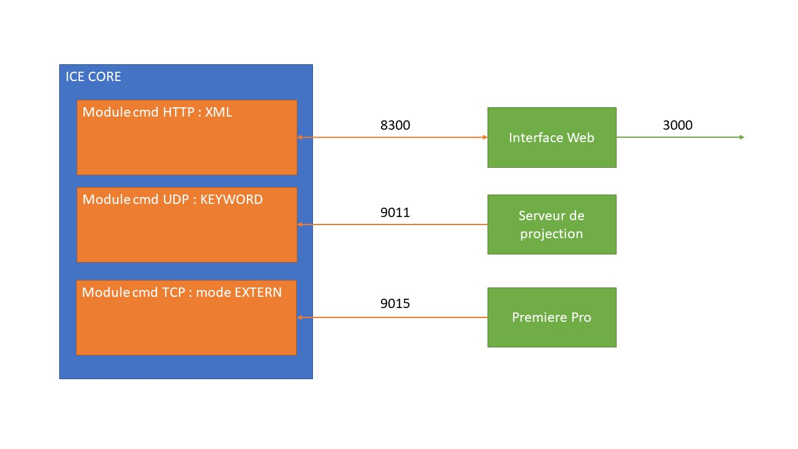
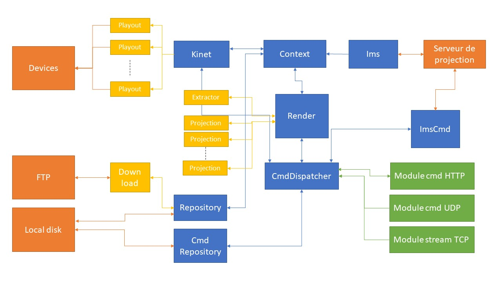

# ICE V2

## Interfaces

## Threads

### Playout

Un thread PLAYOUT est lancé à chaque fois qu'un équipement doit mettre à jour son rendu (panneaux ou dataenabler).
Le thread est lancé par le thread KINET. Le thread créé le payload : il met en forme le corps du message (applique les correction colorimétrique si besoin) et envoi le/les messages à destination de l'équipement.

### Extractor

Un thread EXTRACTOR est lancé pour chaque frame à traiter lors du jeu d'un script ICE. Il permet d'extraire toutes les images et informations nécessaires dans le template pour chaque équipement. Ce thread est lancé par le thread RENDER. 

### Projection

Ces threads PROJECTION sont lancés par le thread RENDER pour chaque panneaux et movingheads de chaque frame à traiter lors du jeu d'un script ICE. Il permet : 

- pour un panneau : de transformer les images extraites du thread EXTRACTOR pour les transformer (resize, move, extract) en l'image finale à envoyer
- pour une movingHead : de transformer les positions de pointage relatives dans la zone de siège en position angulaire en pan/tilt.

### Download

Le thread de DOWNLOAD est lancé une seule fois et tourne constamment. Il permet de lancer les téléchargements des fichiers des scripts accessibles (via FTP ou HTTP). Le remplissage de cette liste de fichiers est remplie par un autre thread (REPOSITORY).

### CmdDispatcher

Le thread de CMDDISPATCHER est lancé une seule fois et tourne constamment. Il permet de centraliser la réception de toutes les commandes envoyés au système est de les dispatcher aux différents threads adapté au traitement des commandes.

### Repository

Le thread de REPOSITORY est lancé une seule fois et tourne constamment. Il permet de : 

- lister les scripts ICE téléchargés
- remplir la liste des fichiers à télécharger
- mettre à jour la liste des scripts ICE téléchargés

### CmdRepository

Le thread de CMDREPOSITORY est lancé une seule fois et tourne constamment. Il permet d'exécuter les commandes liées au REPOSITORY en : 

- synchronisant manuellement un script
- changeant la priorité d'un script (obligation de garder le script même si plus disponible)
- récupérer les fichiers de synchronisation

### Kinet

Le thread de KINET est lancé une seule fois et tourne constamment. Il permet de : 

- pour une frame donnée, lancer  tous les threads de PLAYOUT pour commander les équipements ICE
- d'exécuter une commande permettant de piloter manuellement un équipement

### Render

Le thread de RENDER est lancé une seule fois et tourne constamment. Il permet de préparer en avance pour chaque frame toutes les données nécessaires à la mise à jour des équipements ICE qui désservira le thread KINET. Pour cela, il utilise les threads EXTRACTOR et PROJECTION. Il lit l'image du template dans le script joué et traite cette image.
C'est le thread le plus temporellement critique.

### Context

Le thread de CONTEXT est lancé une seule fois et tourne constamment. Il permet de gérer le script qui doit être joué en fonction du status du serveru de projection (CPL + timecode).

Il permet également d'exécuter toutes les commandes (ou presque) qui échangent avec l'interface web.

### Ims 

Le thread de IMS est lancé une seule fois et tourne constamment. Il est critique car il permet de récupérer le statut du serveru de projection (ce qui est joué et à quel timecode). 

### ImsCmd

Le thread de IMSCMD est lancé une seule fois et tourne constamment. Il permet d'interroger le serveru de projection sans polluer les demandes de statut qui sont critiques. 
Il permet de récupérer la liste des CPLS disponibles sur le serveur de projection et de récupérer les informations les concernants.