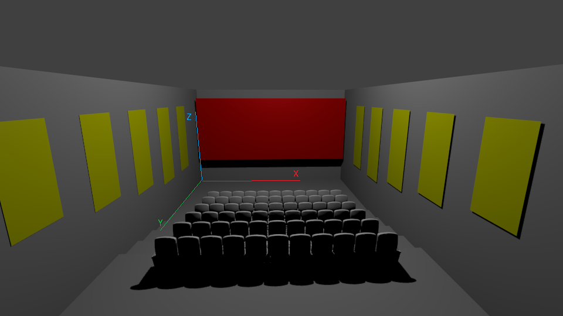

# ICE-CORE CONF

Ce document a pour but d'expliquer la configuration de l'installation du service ICE-CORE
La configuration comprend 6 fichiers : 

- IMSConfiguration.xml : définit comment communiquer avec le serveru de projection
- RepoConfiguration.xml : définit comment communiquer avec le serveur FTP pour récupérer les scripts ICE
- LutConfiguration.xml : définit les fichiers de corrections colorimétriques par type d'équipements
- KinetConfiguration.xml : définit les equiements ICE (panels + DMXs)
- IceConfiguration.xml : définit les mesures et les positionnements des équipements dans la salle
- SceneConfiguration.xml : définit l'ensemble des scènes jouables sur le serveur

## IMSConfiguration

```
<?xml version="1.0" standalone="no" ?>
<configuration>
    <type>Barco</type>
    <port>43758</port>
    <ip>10.49.142.50</ip>
    <interface>eno1</interface>
    <credentials>WVdSdGFXNEtRV1J0YVc0eE1qTTA</credentials>
    <syncRate>6</syncRate>
    <offsetPlayer2K>167</offsetPlayer2K>
    <offsetPlayer4K>85</offsetPlayer4K>
</configuration>
```

### Liste des champs

- *type* : peut prendre comme valeurs **Barco**, **Christie**, **Doremi**
- *port* et *ip* : doivent être changé en conséquence
- *credentials* : représente une chaine de caractère comprenant le login et le password pour se connecter au serveur de projection doublement encodé en base64
- *interface* : représente le nom de l'interface réseau (tel que défini dans *ifconfig*) pour recevoir les messages UDP provenant du serveru de projection
- *syncRate* r: eprésente le temps en millisecondes entre chaque mise à jour du timecode du serveru de projection
- *offsetPlayer2K* et *offsetPlayer4K* : représente le décalage temporel entre le timecode reçu du serveur de projection et le timecode actuel de l'image rendue à l'écran

## RepoConfiguration

```
<?xml version="1.0" standalone="no" ?>
<configuration>
    <host>ftpnumerique.cgrcinemas.fr</host>
    <port>21</port>
    <credentials>WVhKMGFIVnlDbGxYWlZaTVZITlRXa2c9</credentials>
    <rights>QC</rights>
    <type>ROOM</type>
    <scriptsPath>/opt/test_reference/BUILD/BIN/data/SCRIPTS/</scriptsPath>
    <connector>FTP</connector>
</configuration>
```

### Liste des champs

- *host* : l'adresse pour accéder au serveru FTP
- *port* : port d'accès au serveru FTP
- *credentials* : représente une chaine de caractère comprenant le login et le password pour se connecter au serveur FTP doublement encodé en base64
- *scriptsPath* : le chemin disque de sauvegarde de tous les scripts ICE téléchargés
- *rights* : peut prendre comme valeurs **QC**, **CLASSIC** pour un serveru ayant droit ou non de lire dans le répertoire FTP de test
- *type* : peut prendre comme valeurs **ROOM**, **DOORWAY** pour un serveur salle ou un serveur SAS
- *connector* : peut prendre comme valeurs **FTP**, **HTTP**. HTTP sera disponible lorsque la gestion centralisée sera mise en place.

D'autres champs seront mis en place lorsque la gestion centralisée sera accessible.

## LutConfiguration

```
<?xml version="1.0" standalone="no" ?>
<configuration>
    <lut name="PanelV1" filename="/opt/test_reference/BUILD/BIN/data/panelV1.lut" />
    <lut name="PanelV2" filename="/opt/test_reference/BUILD/BIN/data/panelV2.lut" />
	<calib name="ParV1" filename="/opt/test_reference/BUILD/BIN/data/parV1.calib" />
	<calib name="ParV2" filename="/opt/test_reference/BUILD/BIN/data/parV2.calib" />
	<calib name="MhV1" filename="/opt/test_reference/BUILD/BIN/data/mhV1.calib" />
	<calib name="MhV2" filename="/opt/test_reference/BUILD/BIN/data/mhV2.calib" />
	<calib name="BackV1" filename="/opt/test_reference/BUILD/BIN/data/backV1.calib" />
	<calib name="BackV2" filename="/opt/test_reference/BUILD/BIN/data/backV2.calib" />
</configuration>
```

Chaque lut correspond à une correction pour un type de panel donné. Donc en principe, une seule ligne *lut* doit être présente.
Ces luts seront construites en amont et validés avant d'être réellement utilisées pour chaque type de panneaux.

Chaque calibration correspond à une correction pour un type d'équipement DMX donné (backlight, moving ou PAR).
Ces calibrations seront construites en amont et validés avant d'être réellement utilisées pour chaque équipement.

### Liste des champs

- *name* : le nom de la correction, référence utilisée pour être appliquer à un équipement dans le fichier *KinetConfiguration.xml*
- *filename* : le chemin disque du fichier décrivant la correction à appliquer

## KinetConfiguration

```
<?xml version="1.0" standalone="no" ?>
<configuration interface="eno2">
    <!-- name is important to relate to the template, sizePixel (or pitch) in mm, nbPixels is width * height-->
    <panel name="L1" ip="10.0.0.141" serial="0xffffffff" sizePixel="60" nbPixels="1440">
        <lut>PanelV2</lut>
    </panel>
    <panel name="L2" ip="10.0.0.142" serial="0xeeeeeeee" sizePixel="60" nbPixels="1440">
        <lut>PanelV2</lut>
    </panel>
    <panel name="R1" ip="10.0.0.151" serial="0xdddddddd" sizePixel="60" nbPixels="1440">
        <lut>PanelV2</lut>
    </panel>
    <panel name="R2" ip="10.0.0.152" serial="0xcccccccc" sizePixel="60" nbPixels="1440">
        <lut>PanelV2</lut>
    </panel>

    <DMX name="Data Enabler Pro" ip="10.0.0.100" serial="0xbbbbbbbb">
        <device name="BL-1" type="BACKLIGHT" dmxOffset="138" formatBuffer="RGB">
            <calib>BackV1</calib>
        </device>
        <device name="BL-2" type="BACKLIGHT" dmxOffset="141" formatBuffer="RGB">
            <calib>BackV1</calib>
        </device>
        <device name="BL-3" type="BACKLIGHT" dmxOffset="144" formatBuffer="RGB">
            <calib>BackV1</calib>
        </device>
        <device name="BL-4" type="BACKLIGHT" dmxOffset="147" formatBuffer="RGB">
            <calib>BackV1</calib>
        </device>
        <device name="MH-LF" type="MOVINGHEAD" dmxOffset="80" formatBuffer="I.PpTtZR.G.B.W........" zoom="128">
            <calib>MhV2</calib>
            <ref>MhV1</ref>
        </device>
        <device name="PAR-L1" type="PAR" dmxOffset="0" formatBuffer="I.ZR.G.B.W....." zoom="128">
            <calib>ParV1</calib>
        </device>
        <device name="PAR-L2" type="PAR" dmxOffset="20" formatBuffer="I.ZR.G.B.W....." zoom="128">
            <calib>ParV1</calib>
        </device>
    </DMX>
</configuration>
```

### Liste des champs

- *interface* : nom de l'interface réseau (tel que défini dans *ifconfig*) pour communiquer avec les panneaux et le data enabler.
- panel : 
	- *name* : le nom du panneau (il est important de respecter la notation L1, L2 ... , R1, R2 ... Ce nom est utilisé comme référence dans le fichier *IceConfiguration*
	- *ip* : l'adresse IP du panneau
	- *serial* : champs non utilisé
	- *sizePixel* : pitch d'un pixel à l'autre représente en mm
	- *nbPixels* : le nombre de pixels du panneau (largeur x hauteur). A partir de cette infos, on sait retrouver comment est fait le panneau.
	- *lut* : référence à la correction colorimétrique à appliquer sur le panneau. Voir LutConfiguration
- DMXS : 
	- *name* : nom donné au data enabler
	- *ip* : l'adresse IP du data enabler
	- *serial* : champs non utilisé
		- device : 
			- *name* : le nom du device. Ce nom est utilisé comme référence dans le fichier *IceConfiguration*
			- *type* : peut prendre comme valeurs **BACKLIGHT**, **PAR**, **MOVINGHEAD**
			- *dmxOffset* : adresse DMX configurée sur le data enabler ou le device
			- *formatBuffer* : définit le format du message DMX à envoyer à l'équipement
			- *calib* : référence à la correction colorimétrique à appliquer sur l'équipement. Voir LutConfiguration
			- *ref* : référence à la correction colorimétrique à appliquer sur l'équipement pour retrouver le couleur désirée initiale. Nécessaire sur un équipement V2 puisque les scripts sont étalonnés avec des équipements V1.
			- *zoom* : utile pour les PARs et les movingHead. Définit l'angle d'ouverture par défaut du device à régler selon la configuration de la salle.
			
### Format buffer

- Backlight V1 et V2 : "RGB"
- Par V1 : "PpTtI....Z.....R.G.B.W."
- Par V2 : "I.PpTtZR.G.B.W........"
- Moving V1 : "I....Z....R.G.B.W."
- Moving V2 : "I.ZR.G.B.W....."

## IceConfiguration

```
<?xml version="1.0" standalone="no"?>
<configuration>
	<screen width="9000" height="4000" offsetX="180" offsetZ="1600"/>
	<seat side="left" depth="front" offsetX="1100" offsetY="5200" offsetZ="850"/>
	<seat side="right" depth="rear" offsetX="8250" offsetY="11300" offsetZ="1700"/>
	
	<panel name="L1" side="left" offsetX="0" offsetY="1930" offsetZ="1750" width="1200" height="3240"/>
	<panel name="R1" side="right" offsetX="9360" offsetY="1930" offsetZ="1750" width="1200" height="3240"/>
	<panel name="L2" side="left" offsetX="0" offsetY="4130" offsetZ="1750" width="1200" height="3240"/>
	<panel name="R2" side="right" offsetX="9360" offsetY="4130" offsetZ="1750" width="1200" height="3240"/>
	<panel name="L3" side="left" offsetX="0" offsetY="6330" offsetZ="2110" width="1200" height="2880"/>
	<panel name="R3" side="right" offsetX="9360" offsetY="6330" offsetZ="2110" width="1200" height="2880"/>
	<panel name="L4" side="left" offsetX="0" offsetY="8530" offsetZ="2470" width="1200" height="2520"/>
	<panel name="R4" side="right" offsetX="9360" offsetY="8530" offsetZ="2470" width="1200" height="2520"/>
	<panel name="L5" side="left" offsetX="0" offsetY="10730" offsetZ="2830" width="1200" height="2160"/>
	<panel name="R5" side="right" offsetX="9360" offsetY="10730" offsetZ="2830" width="1200" height="2160"/>
	
	<movingHead name="MH_LF" side="left" depth="front" offsetX="200" offsetY="9650" offsetZ="4970" panFullAngle="540" tiltFullAngle="220" biasPan="6" biasTilt="11" minX="" maxX="" minY="" maxY="" minZ="" maxZ=""/>
	<movingHead name="MH_LR" side="left" depth="rear" offsetX="200" offsetY="11500" offsetZ="5000" panFullAngle="540" tiltFullAngle="220" biasPan="6" biasTilt="11" minX="" maxX="" minY="" maxY="" minZ="" maxZ=""/>
	<movingHead name="MH_RF" side="right" depth="front" offsetX="9360" offsetY="9700" offsetZ="4970" panFullAngle="540" tiltFullAngle="220" biasPan="6" biasTilt="11" minX="" maxX="" minY="" maxY="" minZ="" maxZ=""/>
	<movingHead name="MH_RR" side="right" depth="rear" offsetX="9360" offsetY="11500" offsetZ="5000" panFullAngle="540" tiltFullAngle="220" biasPan="6" biasTilt="11" minX="" maxX="" minY="" maxY="" minZ="" maxZ=""/>
</configuration>
```



### Liste des champs

Toutes les valeurs d'offset se font par rapport au même point de référence : le coin inférieur gauche de la salle au niveau de l'écran.

- *screen* : 
	- *width* et *height* : taille de l'écran en millimètres
	- *offsetX* et *offsetZ* : positionnement de l'écran dans la salle
- *seat* : définit la zone de positionnement des movingheads
	- *side* : prend comme valeur **left** (en combinaison de *depth*=**front**) ou **right** (en combinaison de *depth*=**rear**)
	- *depth* : prend comme valeur **front** (en combinaison de *side*=**left**) ou **rear** (en combinaison de *side*=**right**)
	- *offsetX*, *offsetY* et *offsetZ* : définit la position du siège dans la salle pour le rendu de l'interface scene
- *panel* :
	- *name* : identifie le panneau concerné
	- *side* : définit de quel côté se trouve le panneau, **left** ou **right**
	- *offsetX*, *offsetY* et *offsetZ* : définit le positionnement du coin inférieur gauche pour les panneaux situés à droite et le coin inférieur droite pour les panneaux situés à gauche
	- *width* et *height* : définit la taille en millimètre du panneau
- *movingHead* :
	- *name* : identifie la movinghead concernée
	- *side* : prend comme valeur **left** ou **right**
	- *depth* : prend comme valeur **front** ou **rear**
	- *offsetX*, *offsetY* et *offsetZ* : définit la position de la movinghead dans la salle
	- *panFullAngle* et *tiltFullAngle* : définit les rotations maximales sur chaque axe
	- *biasPan* et *biasTilt* : définit les décalages de positionnement angulaire des movingheads. Un outil a été créé pour récupérer ces valeurs
	- *min/max(X/Y/Z)* : définit les positions minimales et maximales pour chaque movingHead (un réglage doit être effectué pour connaitre ses positions)
	
### panFullAngle/tiltFullAngle

- Movinghead V1 : 540/270
- Movinghead V2 : 540/220

### biasPan/biasTilt

Un outil a été créé : **CALIB-MH.exe**.
Il se lance depuis un poste Windows connecté sur le même réseau que le serveur ICE salle.

Depuis l'outil, renseignez l'ip du serveur ICE sur le réseau et cliquez sur le bouton *Connect*.

Les panneaux sont montés de manière symétrique dans une salle. Nous allons utiliser cette caractéristique à notre avantage.
Le nom du device est le nom donné aux movingHead dans les fichiers de configuration. 

#### Pan : selon la profondeur de la salle

- Mettre la valeur de pan à 0°
- Changer la valeur de tilt pour que la movingHead concernée pointe sur le mur d'en face
- Vérifier que le pointage de la movingHead (vis-à-vis des panneaux du mur d'en face) correspond à la position de la movinghead (vis-à-vis des panneaux situés sous la movinghead)
- Modifier la valeur du pan pour que le positionnement coincide. On peut alors lire la valeur du biasPan et la reporter dans le fichier de configuration

#### Tilt : selon la hauteur de la salle

- Garder la valeur de pan corrigée
- Vérifier que le pointage de la movingHead (vis-à-vis des panneaux du mur d'en face) correspond à la position de la movinghead (vis-à-vis des panneaux situés sous la movinghead)
- Modifier la valeur du tilt pour que le positionnement coincide. On peut alors lire la valeur du biasTilt et la reporter dans le fichier de configuration

<video width="640" height="480" controls>
  <source src="Calib-MH.mp4" type="video/mp4">
</video>