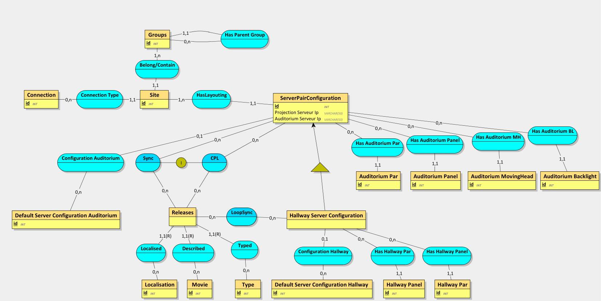
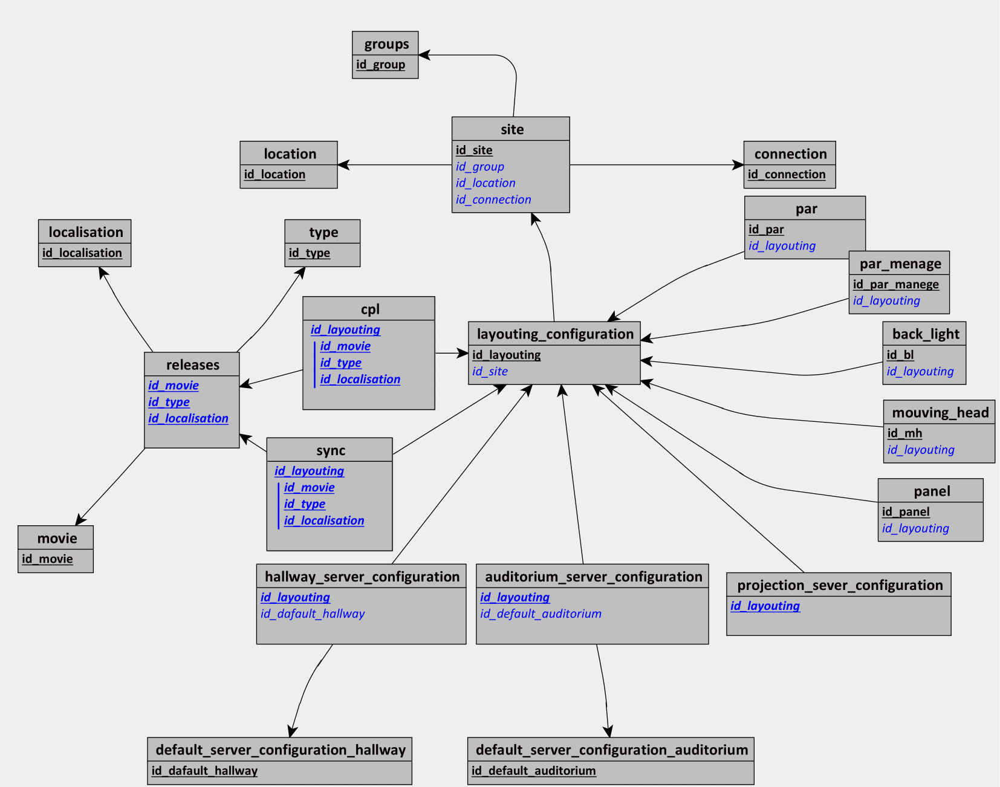

# Base de données du WebCentral

Voici le modèle conceptuel



## Description des entités de la base de données

### Groups

Cette entité contient des groupes de cinémas.

### Site

Cette entité correspond à la liste des cinémas. Un site ne peut etre relier qu'a un seul groupe.

### Location & Connection

Ce sont des entité qui agissent comme des tags pour l'entité Site.

### LayoutingConfiguration

Cette entité représente la combisation de l'auditorium et du couloir d'une salle ICE.

### Par, ParMenage, BackLight, MouvingHead & Panel

Ces 5 entités constiue la liste du materiel présent dans le layouting.

### Default Server Configuration Hallway & Default Server Configuration Auditorium

Ces 2 entités contiennent des configurations genériques/communes pour les serveurs ICE, couloir (Hallway) & auditorium.

### ProjectioN Server Configuration, Hallway Server Configuration & Auditorium Server Configuration

Ces 3 entités continnent les configurations de chaque serveur, l'ID du layouting est le meme que celui des configurations. Elles héritent de la totalité des information de l'entité LayoutingConfiguration.

### Type, Localisation & Movie

Ces 3 entités contiennent des informations relatives à une release. Elles forment une clé primaires composée pour l'entité Releases.

### Releases

Cette entité rassemble tout les informations sur une release.

### CPL

Cette association résulte sur la création d'une table dans le modèle logique de données. Elle contient les données essentielles pour la liaison entre les layouting et les releases.

### Sync

Cette association résulte aussi sur la création d'une table dans le modèle logique de données. Elle contient les informations sur le fichier sync. Elle a une contrainte d'inclusion sur l'association CPL, car un fichier sync est toujours en lien avec un CPL.
Cette contrainte d'inclusion est représenté par un trigger dans le modèle phisyque de données

```
CREATE TRIGGER `cpl_exists`
BEFORE INSERT ON `sync`
FOR EACH ROW
    BEGIN
        IF NOT EXISTS (SELECT * FROM `cpl` WHERE `id_layouting` = `NEW`.`id_layouting` && `id_type` = `NEW`.`id_type` && `id_movie` = `NEW`.`id_movie` && `id_localisation` = `NEW`.`id_localisation`) THEN
            SIGNAL SQLSTATE '45000' SET MESSAGE_TEXT='Aucun CPL correspondant';
        END IF;
    END;
```

## Annexes


