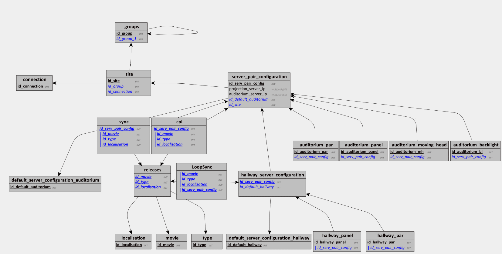

# Base de données du WebCentral

Voici le modèle conceptuel


## Description des entités de la base de données

### Groups

Cette entité contient des groupes de cinémas. Dans notre utilisation, les occurrences de l'entité 'Groups' seront structurées sous la forme d'un unique arbre. Un nœud sera donc le nœud racine de tous les autres. L'association réflexive HasParentGroup décrit la relation de parentalité entre les nœuds de l'arbre. Les nœuds directement enfants aux nœuds racines décriront des espaces géographiques (Inde, Espagne, Estonie, etc ...). Les nœuds du niveau suivant décriront les exploitant de salles locales. Cette structure ne permet donc pas de modéliser la présence d'exploitants internationale, car ceux-ci devront partager plusieurs parents (donc plusieurs lieux géographiques). Or, une structure en arbre ne le permet pas. Cependant, si cela s'avère nécessaire, il sera possible de faire évoluer la structure en arbre vers une structure en graphe cyclique et ainsi permettre à un nœud d'exploitant de salle d'avoir plusieurs parents. Pour cela, il faudra modifier les cardinalités de l'association "Has Parent Group" vers 0,n-0,n .

### Site

Cette entité correspond à la liste des cinémas. Un site ne peut être relier qu'a un seul groupe.

### Connection

Cette entité agit comme un tag pour l'entité Site.

### Server Pair Configuration

Cette entité contient les informations nécessaires à la configuration du Serveur ICE de l'auditorium, l'ip du serveur de projection, l'ip du serveur ICE de l'auditorium.

### Auditorium Par, Auditorium Panel, Auditorium BackLight & Auditorium MovingHead

Ces 4 entités constituent la liste du matériel présent dans le Server Pair Configuration.

### Hallway Server Configuration

Cette entité contient les configurations du serveur ICE du couloir (Hallway), l'ID du Server Pair Configuration est le même que celui de la configuration.

### Hallway Par & Hallway Panel

Ces 2 entités constituent la liste du matériel présent dans le Hallway Server Configuration.

### Default Server Configuration Hallway & Default Server Configuration Auditorium

Ces 2 entités contiennent des configurations génériques/communes pour les serveurs ICE, couloir (Hallway) & auditorium.

### Type, Localisation & Movie

Ces 3 entités contiennent des informations relatives à une relieuse. Elles forment une clé primaire composée pour l'entité Releases. L'entité Localisation représente la cible première de la langue audio, des textes contenues dans le film (sans les sous-titres) et de la censure.

### Releases

Cette entité rassemble toutes les informations sur une release.

### CPL

Cette association résulte sur la création d'une table dans le modèle logique de données. Elle contient les données essentielles pour la liaison entre les Hallway Server Configuration et les releases.

### Sync

Cette association résulte aussi sur la création d'une table dans le modèle logique de données. Elle contient les informations sur le fichier sync. Elle a une contrainte d'inclusion sur l'association CPL, car un fichier sync est toujours en lien avec un CPL.
Cette contrainte d'inclusion est représentée par un trigger dans le modèle phisyque de données.

```
CREATE TRIGGER `cpl_exists`
BEFORE INSERT ON `sync`
FOR EACH ROW
BEGIN
IF NOT EXISTS (SELECT * FROM `cpl` WHERE id_serv_pair_config = NEW.id_serv_pair_config && id_type = NEW.id_type && id_movie = NEW.id_movie &   id_localisation = NEW.id_localisation) THEN
SIGNAL SQLSTATE '45000' SET MESSAGE_TEXT='Aucun CPL correspondant';
END IF;
END;
```

## Annexes

### MLD


