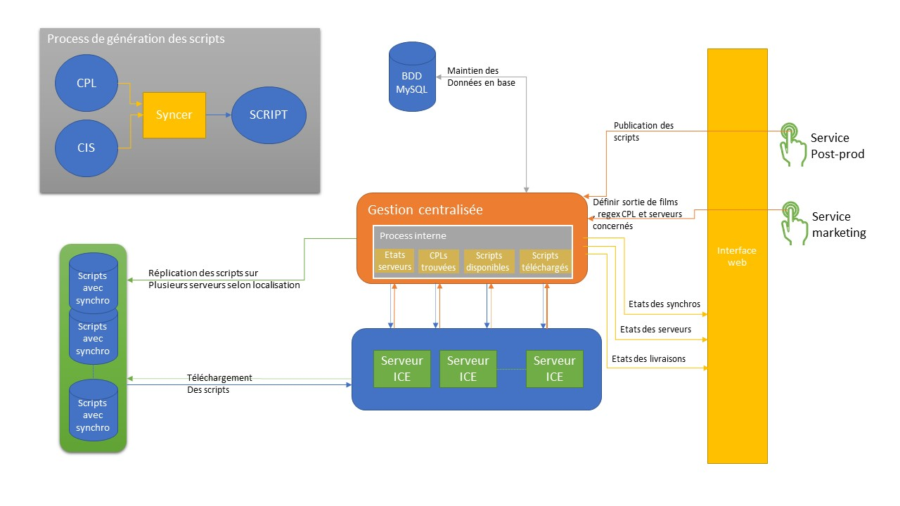

# Archi CENTRAL

## Management interface

Une interface web en nodeJS permet à la post-production permet de manager la gestion centralisée. Elle permet de :

- publier un script ICE sur le serveur central par la post-production
- gérer le parc ICE : 
    - définir des groupes regroupants plusieurs cinémas
    - définir des cinémas
    - définir des auditoriums (plusieurs auditoriums par cinéma sont possibles)
    - définir les serveurs ICE (un serveur salle et un serveur SAS par auditorium)
- vérifier l'état des serveurs ICE : 
    - si le serveur de projection répond
    - si le serveur ICE répond
    - si les équipements lié au serveur ICE répondent
- gérer les livraisons des scripts avec suivi : 
    - définir une feature par film
    - définir une ou plusieurs releases par feature : 
        - une release est définir par une liste et/ou de groupes de cinémas
        - par des dates de début et de fin d'exploitation
        - par un script Feature, SAS et loop
        - ou par une release parent (lorsque le même script avec des cuts sont utilisés), dans ce cas on peut définir des cuts et ajouter des Cpls intermédiaires
- vérifier le status des livraisons de scripts
- vérifier les cpls trouvés sur les serveurs liées à chaque release
- vérifier les synchronisations des cpls trouvées sur les serveurs liées à chaque release

## Fonctionnement

Le dossier disque contenant tous les scripts ICE avec leur synchronisation sur le serveur de la gestion centralisée est répliqué sur plusieurs serveurs, appelés serveurs de REPO. 
Un service REPO permet aux serveurs ICE de demander le téléchargement d'un fichier si présent sur disque d'un des serveurs de REPO. Le serveru de gestion centralisée est également un serveur de REPO.

Le serveur ICE demande la liste des fichiers dont il a l'accès. Les fichiers listés qui ne sont pas présents sur le serveur ICE seront téléchargés en utilisant un des services de REPO.

La récupération des cpls sur les serveurs de projection et les synchronisations de ces dernières pour les releases est automatique et tourne H24.
